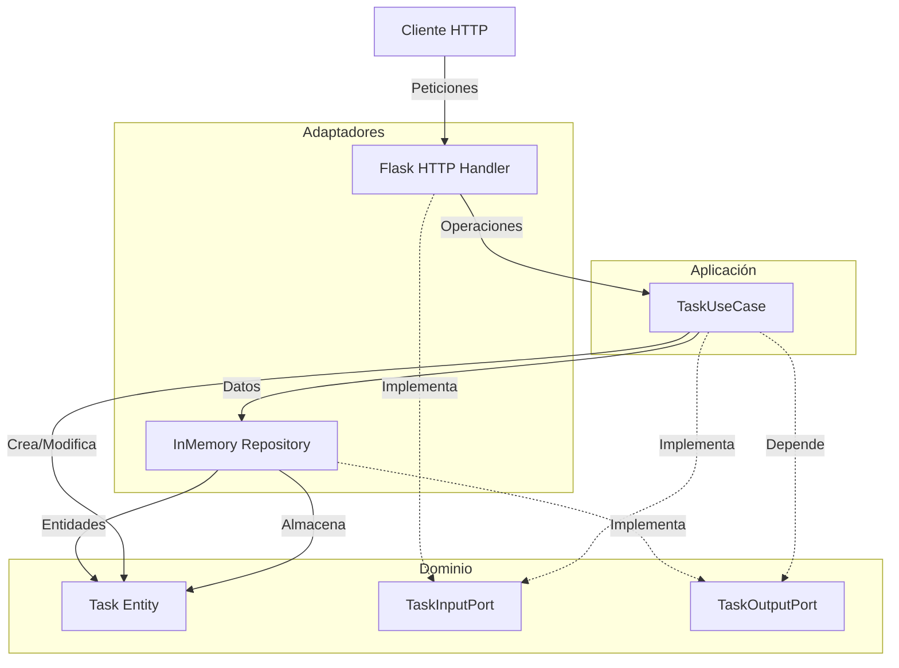
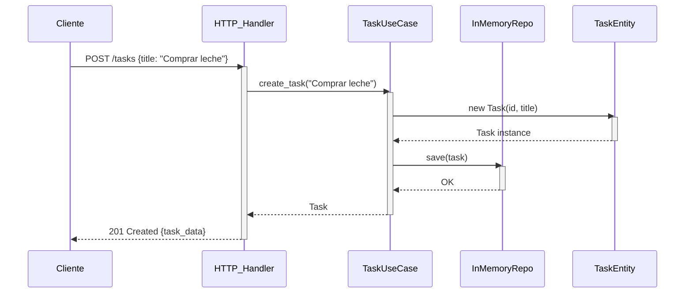

# Task Manager – Hexagonal Architecture

This service allows you to create, list tasks and mark as completed using a hexagonal architecture (ports and adapters). Business logic is decoupled from infrastructure details, such as the web framework or storage.

## 📋 Endpoints disponibles

### ➕ Create a task

Create a new task with a title.

```bash
curl -X POST http://localhost:5000/tasks \
  -H "Content-Type: application/json" \
  -d '{"title": "Aprender arquitectura hexagonal"}'
```

### 📄 List all tasks

Returns a list of all created tasks.

```bash
curl http://localhost:5000/tasks
```

### Marks a task as completed by setting its done attribute to true.

```bash
curl -X PUT http://localhost:5000/tasks/<id>/done
```

### Flowchart 


### Sequence diagram


### Demostración nueva funcionalidad

### Request /POST 

### Request /PATCH

### Request /GET


## Instalación y ejecución

1. Clona el repositorio:

```bash
git clone https://github.com/SwEng2-2025i/MV7h.git
cd Class_Activity_1
cd Aguilas
```

2. Instala Flask:
   
```bash
pip install flask
```

3. Ejecuta la app:
   
```bash
python main.py
```