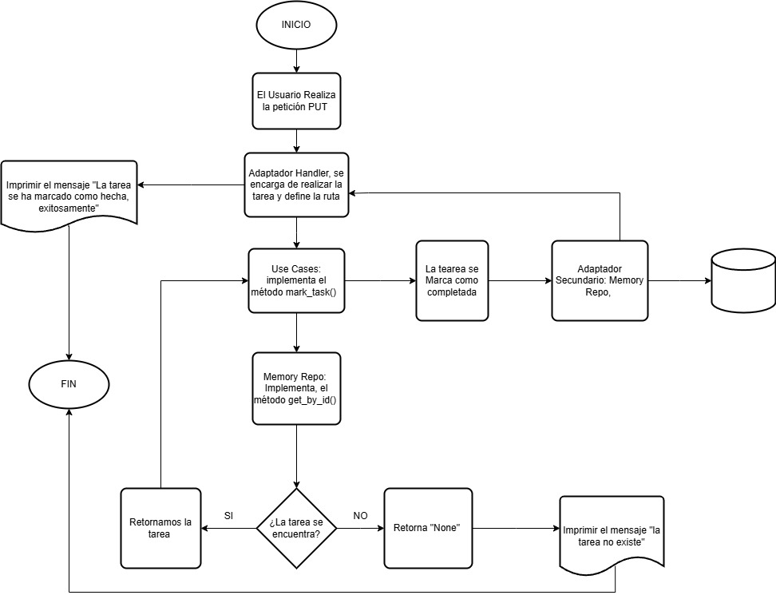

# Task Manager – Hexagonal Architecture

This service allows you to create and list tasks using a hexagonal architecture (ports and adapters). Business logic is decoupled from infrastructure details, such as the web framework or storage.


## 📋 Endpoints disponibles
|Metodo|Endpoint|Descripción|
|------|--------|-----------|
|GET   |/tasks  |Devuelve todas las tareas creadas|
|POST  |/tasks  |Crea una tarea|
|PUT   |/tasks/id/done|Marca una tarea como completada|

## 📦 Payload & Response
### ➕ Crear una tarea
#### POST /tasks

Crea una nueva tarea y le asigna un titulo.
```json
{
  "title": "Terminar documentación"
}
```

Comando **CURL**
```bash
curl -X POST http://localhost:5000/tasks \
  -H "Content-Type: application/json" \
  -d '{"title": "Terminar documentación"}'
```
Response

```json
{
    "done": false,
    "id": "c4042f7f-2781-495e-9b3a-cb77756aa0d9",
    "title": "Terminar documentacion"
  }
```

### 📄 Listar todas las tareas

#### GET /tasks
Retorna una lista de todas las tareas creadas

```bash
curl http://localhost:5000/tasks
```

Response
```json
  {
    "done": false,
    "id": "c4042f7f-2781-495e-9b3a-cb77756aa0d9",
    "title": "Terminar Documentacion"
  },
  {
    "done": false,
    "id": "f4205761-f1bd-495a-8fde-482d32a8f3da",
    "title": "Terminar Lab 1"
  },
  {
    "done": false,
    "id": "4feb9171-c471-4832-ba60-c728fa51ddfc",
    "title": "Ver final Champions"
  }
```
### ✅ Marcar tarea como completada

#### POST /tasks/&lt;id&gt;/done
Marca una tarea como completada buscandola primero por id.

CURL
```bash
curl -X PUT http://localhost:5000/tasks/4feb9171-c471-4832-ba60-c728fa51ddfc/done
```
Response
```json
{
  "messagge:": "Tarea marcada como completa"
}
```
Ahora, si volvemos a hacer get, vemos que la tarea se marco como completada:

```json
  {
    "done": true,
    "id": "4feb9171-c471-4832-ba60-c728fa51ddfc",
    "title": "Ver final Champions"
  }
```

A continuación se presenta un diagrama de flujo del funcionamiento del nuevo endpoint *PUT*:



