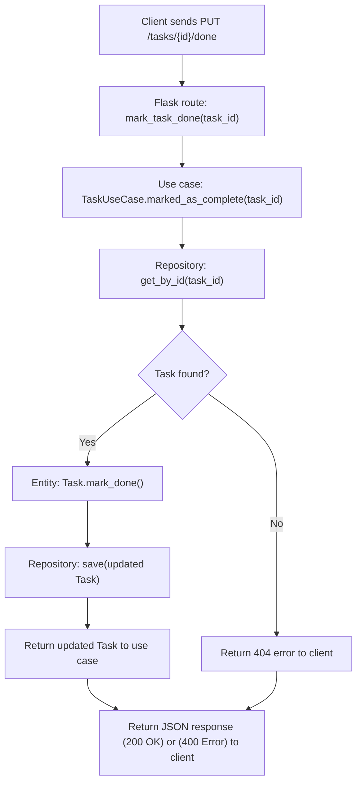

# Task Manager – Hexagonal Architecture

This service allows you to create and list tasks using a hexagonal architecture (ports and adapters). Business logic is decoupled from infrastructure details, such as the web framework or storage.

## 📋 Endpoints disponibles

### ➕ Create a task

Create a new task with a title.

```bash
curl -X POST http://localhost:5000/tasks \
  -H "Content-Type: application/json" \
  -d '{"title": "Aprender arquitectura hexagonal"}'
```

### 📄 List all tasks

Returns a list of all created tasks.

```bash
curl http://localhost:5000/tasks
```

### ✅ Mark task as done

Marks a task as completed by setting its done attribute to true.

```bash
curl -X PUT http://localhost:5000/tasks/<id>/done
```

Path Parameter:

{id}: the unique identifier of the task to be marked as done.

Successful response (HTTP 200): JSON

```json
{
  "done": true,
  "id": "daa344e4-d3ff-4dfd-bc73-63022b139ec3",
  "title": "Finish challenge"
}
```

Error responses:

404 Not Found: Task not found.

## 🔁 Flowchart – Mark Task as Done


