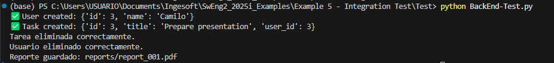
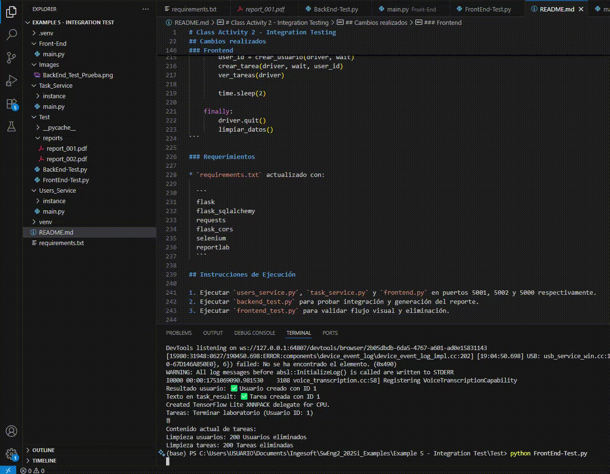

# Class Activity 2 - Integration Testing

## Estudiante

**Nombre:** Daniel Delgado
**ID:** 1025521116

## Descripción General

Esta actividad extiende el ejemplo de pruebas de integración implementando:

1. **Limpieza de datos** tras la ejecución de pruebas, tanto en el backend como desde el frontend.
2. **Generación automática de reportes PDF**, con numeración secuencial y preservación de archivos anteriores.

## Resultados

* Las pruebas backend ahora crean, verifican y eliminan usuarios y tareas.
* Se verifica que los datos han sido correctamente eliminados de la base de datos.
* Se genera un archivo PDF con los resultados de cada prueba, guardado en la carpeta `/reports`.
* El frontend incluye botones de eliminación para tareas y el test automatizado con Selenium interactúa con ellos para validar la eliminación visual.

## Cambios realizados

### Backend

Users_Service:

* **`main.py`**:

  * Agregada ruta `DELETE /users/<id>` para eliminar usuarios.
  * Agregado reset `RESET /reset` para resetear usuarios para los tests.

```python
@service_a.route('/users/<int:user_id>', methods=['DELETE'])
def delete_user(user_id):
    user = User.query.get(user_id)
    if user:
        db.session.delete(user)
        db.session.commit()
        return jsonify({'message': 'Usuario eliminado'}), 200
    return jsonify({'error': 'Usuario no encontrado'}), 404

@service_b.route('/reset', methods=['POST'])
def reset_user():
    db.session.query(Task).delete()
    db.session.commit()
    return "Tareas eliminadas", 200
```

Task_Service:

* **`main.py`**:

  * Agregada ruta `DELETE /tasks/<id>` para eliminar tareas.

```python
@service_b.route('/tasks/<int:task_id>', methods=['DELETE'])
def delete_task(task_id):
    task = Task.query.get(task_id)
    if task:
        db.session.delete(task)
        db.session.commit()
        return jsonify({'message': 'Tarea eliminada'}), 200
    return jsonify({'error': 'Tarea no encontrada'}), 404

@service_a.route('/reset', methods=['POST'])
def reset_task():
    db.session.query(User).delete()
    db.session.commit()
    return "Usuarios eliminados", 200
```

* **`backend_test.py`**:

  * Nuevas funciones: `delete_user(id)`, `delete_task(id)`.
  * Se agregó verificación de que los datos hayan sido eliminados correctamente.
  * Se agregó generación de PDF con `reportlab`, guardando reportes como `report_001.pdf`, `report_002.pdf`, etc.

Limpieza de datos

```python
def delete_user(user_id):
    response = requests.delete(f"{USERS_URL}/{user_id}")
    if response.status_code != 200:
        print("No se pudo eliminar el usuario")
    else:
        print("Usuario eliminado correctamente.")

def delete_task(task_id):
    response = requests.delete(f"{TASKS_URL}/{task_id}")
    if response.status_code != 200:
        print("No se pudo eliminar la tarea")
    else:
        print("Tarea eliminada correctamente.")
```

Generación de reportes

```python
from reportlab.pdfgen import canvas
import os

def save_test_report(content):
    os.makedirs("reports", exist_ok=True)
    files = os.listdir("reports")
    num = len([f for f in files if f.endswith(".pdf")]) + 1
    filename = f"reports/report_{num:03}.pdf"

    c = canvas.Canvas(filename)
    c.drawString(100, 800, "Resultado del test de integración:")
    for i, line in enumerate(content.splitlines()):
        c.drawString(100, 780 - i*20, line)
    c.save()
    print(f"📄 Reporte guardado: {filename}")
```

integration_test

```python
def integration_test():
    logs = []

    user_id = create_user("Camilo")
    logs.append(f"Usuario creado con ID {user_id}")

    task_id = create_task(user_id, "Prepare presentation")
    logs.append(f"Tarea creada con ID {task_id}")

    tasks = get_tasks()
    user_tasks = [t for t in tasks if t["user_id"] == user_id]
    assert any(t["id"] == task_id for t in user_tasks), "❌ Task not registered"
    logs.append("✅ Tarea correctamente registrada.")

    delete_task(task_id)
    delete_user(user_id)
    logs.append("🧹 Datos eliminados.")

    tasks = get_tasks()
    assert not any(t["id"] == task_id for t in tasks), "❌ La tarea no fue eliminada"
    logs.append("✅ Limpieza verificada.")

    # Generar PDF con los logs
    save_test_report("\n".join(logs))
```

### Frontend

* **`frontend.py`**:

  * Agregado botón "🗑" en cada tarea listada.
  * Funcionalidad JS para hacer `DELETE` al backend.

```HTML
<button onclick='limpiarDatos()'>Limpiar usuarios y tareas</button>
```

```js
function limpiarDatos() {
  fetch('http://localhost:5001/reset', { method: 'POST' })
    .then(res => res.text())
    .then(data => {
      console.log('Usuarios:', data);
      return fetch('http://localhost:5002/reset', { method: 'POST' });
    })
    .then(res => res.text())
    .then(data => {
      console.log('🧹 Tareas:', data);
      verTareas(); // Refresca lista
      alert('Usuarios y tareas eliminados correctamente');
    })
    .catch(err => {
      console.error('Error en limpieza:', err);
      alert('Error al limpiar usuarios o tareas');
    });
}

```

* **`frontend_test.py`**:

  * Se agregó `eliminar_tarea(driver)` para probar eliminación desde interfaz.
  * Se verifica visualmente que la tarea desaparece de la lista.

Limpiar datos:

```python
import requests

def limpiar_datos():
    try:
        r1 = requests.post("http://localhost:5001/reset")
        print("Limpieza usuarios:", r1.status_code, r1.text)
    except Exception as e:
        print("Error al limpiar usuarios:", e)

    try:
        r2 = requests.post("http://localhost:5002/reset")
        print("Limpieza tareas:", r2.status_code, r2.text)
    except Exception as e:
        print("Error al limpiar tareas:", e)
```

Nuevo main:

```python
def main():
    limpiar_datos()

    options = Options()
    driver = webdriver.Chrome(options=options)

    try:
        wait = WebDriverWait(driver, 10)
        abrir_frontend(driver)
        user_id = crear_usuario(driver, wait)
        crear_tarea(driver, wait, user_id)
        ver_tareas(driver)

        time.sleep(2)

    finally:
        driver.quit()
        limpiar_datos() 
```

### Requerimientos

* `requirements.txt` actualizado con:

  ```
  flask
  flask_sqlalchemy
  requests
  flask_cors
  selenium
  reportlab
  ```

## Instrucciones de Ejecución

1. Ejecutar `main.py` en la carpeta Front-End, `main.py` en la carpeta Task_Service y `main.py` en la carpeta Users_Service, en puertos 5001, 5002 y 5000 respectivamente. 
2. Ejecutar `backend_test.py` para probar integración y generación del reporte.
3. Ejecutar `frontend_test.py` para validar flujo visual y eliminación.

---

## Resultados

Back-End Test:



Front-End Test:



PDF generado:


