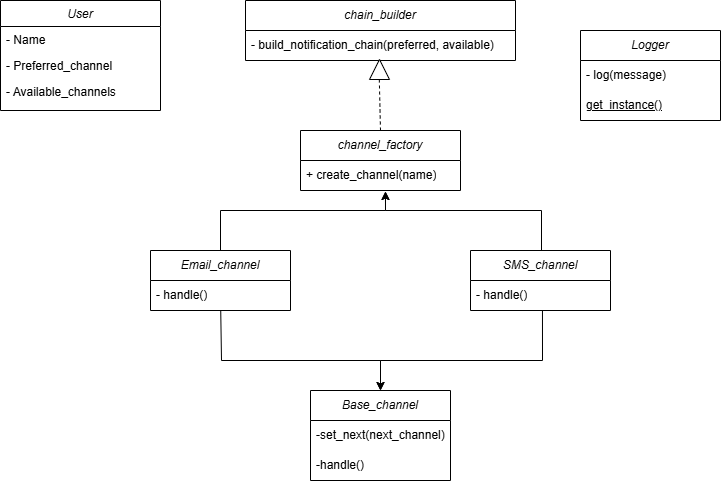

# API REST de Notificaciones a Usuarios

**Autor**: Santiago Nova Acosta

## 📋 Descripción del Sistema

Esta API REST permite registrar usuarios y enviarles notificaciones mediante distintos canales de comunicación (correo electrónico, SMS, push). La entrega se realiza utilizando una **cadena de responsabilidad** que simula fallos y busca un canal alternativo disponible.

El sistema está diseñado en Flask, es modular, y hace uso de patrones de diseño avanzados para mantener el código limpio, extensible y fácil de probar.

---

## 📌 Endpoints Disponibles

| Método | Endpoint                    | Descripción                           |
|--------|-----------------------------|---------------------------------------|
| POST   | `/users`                    | Registra un nuevo usuario             |
| GET    | `/users`                    | Lista todos los usuarios registrados  |
| POST   | `/notifications/send`       | Envía una notificación a un usuario   |

### Ejemplos de Carga Útil (Payload)

#### `POST /users`
```json
{
  "name": "Juan",
  "preferred_channel": "email",
  "available_channels": ["email", "sms"]
}
``` 
#### `POST /notifications/send`
```json
{
  "user_name": "Juan",
  "message": "Tu cita es mañana.",
  "priority": "alta"
}
```
## 🧠 Patrones de Diseño Utilizados

1. Chain of responsability
Permite intentar enviar la notificación a través del canal preferido. Si falla (simulado aleatoriamente), se intenta con los siguientes canales disponibles.
2. Singleton
Utilizado para implementar un logger que registra cada intento de envío de notificación. Solo existe una instancia de este logger durante toda la ejecución del sistema.

## 📂 Estructura del Proyecto

```
Laboratory1/1000156909
├── app.py                          # Punto de entrada de la aplicación
├── models/
│   └── user.py                     # Clase User
├── notifications/
│   ├── channel_base.py             # Clase base para canales
│   ├── email_channel.py            # Canal de correo
│   ├── sms_channel.py              # Canal de SMS
│   └── push_channel.py             # Canal Push
├── services/
│   └── notification_service.py     # Lógica de notificación
├── utils/
│   └── logger.py                   # Logger Singleton
├── swagger/
│   └── swagger_config.py           # Configuración de documentación
└── README.md
```

## 🖼️ Diagrama de Clases y Módulos



## ⚙️ Instalación y ejecución

1. Clona el repositorio:
```
git clone https://github.com/SwEng2-2025i/MV7h.git
cd Laboratory1/1000156909
```

2. Instalar dependencias:
```
pip install flask flasgger
```

3. Ejecutar la aplicación:
```
python app.py
```
## 🧪 Ejemplos de Prueba con curl

### Registrar un usuario

```
curl -X POST http://localhost:5000/users \
  -H "Content-Type: application/json" \
  -d "{\"name\": \"Juan\", \"preferred_channel\": \"email\", \"available_channels\": [\"email\", \"sms\"]}"
```

### Listar usuarios

```
curl http://localhost:5000/users
```

### Enviar una notificación

```
curl -X POST http://localhost:5000/notifications/send \
  -H "Content-Type: application/json" \
  -d "{\"user_name\": \"Juan\", \"message\": \"Tu cita es mañana.\", \"priority\": \"alta\"}"
```

## 📘 Documentación Swagger

Una vez iniciada la app, puedes acceder a la documentación Swagger en:

```
http://localhost:5000/apidocs
```

Ahí podrás probar los endpoints directamente desde una interfaz web interactiva.