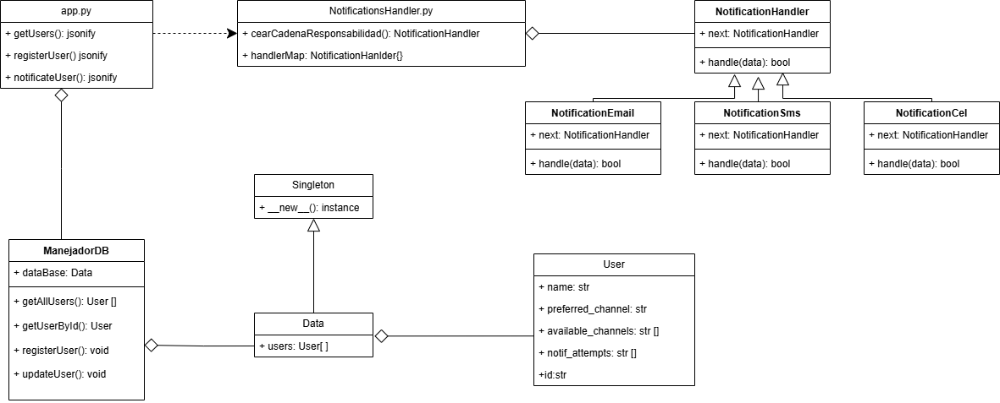

### Nombre: Julian Esteban Mendoza Wilches
El sistema consta de un archivo main principal que es el [`app.py`](app.py) Este es el archivo que crea la aplicación que consta de tres endpoints.

### Endpoints

|Metodo|Endpoint|Descripción|
|------|-------|----------|
|GET   |/users  |Obtiene los usuarios registrados|
|POST  |/users  |Registra un usuario
|POST  |/notifications/send|Envia notifiación a un usuario al logearse

### Payload & Response
#### POST /users
#### Payload
```json
{
  "name": "Ana",
  "preferred_channel": "sms",
  "available_channels": ["email", "cel"]
}
```
#### Response
```json
{
  "message": "Registro Exitoso ",
  "user": {
    "available_channels": [
      "email",
      "cel"
    ],
    "name": "Ana",
    "preferred_channel": "sms"
  }
}
```

### Payload & Response
#### POST/notifications/send
#### Payload
Se manda el id del usuario para conocer cual es el usuario que quiere logearse.
```json
{
    "id":"4c297547-3462-495f-9f69-6cbb52f55132"
}
```
#### Response
```json
{
  "message": "Notificación exitosa via: SMS",
  "usuario": {
    "available_channels": [
      "sms",
      "cel"
    ],
    "id": "4c297547-3462-495f-9f69-6cbb52f55132",
    "name": "Ana",
    "notifAttempts": [
      "SMS"
    ],
    "preferred_channel": "email"
  }
}
```
### Response
#### GET /users
```json
[
  {
    "available_channels": [
      "sms",
      "cel"
    ],
    "id": "4c297547-3462-495f-9f69-6cbb52f55132",
    "name": "Ana",
    "notifAttempts": ["email"],
    "preferred_channel": "email"
  }
]
```
La documentación completa se encuentra en **Swagger** ejecutando http://localhost:5000/apidocs/ al correr [`app.py`](app.py).
La comuniación entre los modulos y clases se ejemplifica en el siguiente diagrama de clases:



### Justificación Patrones de diseño
#### Singleton
El patrón Singleton el cual pertenece a los patrones creacionales y permite crear una sola instancia de una clase se implementa en la clase Data de [`Data.py`](Data.py). Esta clase contiene el atributo *users* que simula una base de datos para guardar los usuarios. Como queremos que solo exista una misma base de datos, la clase Data hereda el comportamiento de la clase Singleton [`Singleton.py`](Singleton.py) que se crea para modelar este patrón y asi asegurar una unica instancia.
### Chain of responsability
El patrón Chain of responsability es un patrón de comportamiento que permite pasar solicitudes a lo largo de una cadena de controladores al recibir una solicitud. Esta solicitud sera manejada por el controlador que este encargado de procesar esta solicitud en especifico. En el diseño del codigo se decide implementar este patrón con el objetivo de implementar el requisito funcional de notificar al usuario a partir de una lista de canales disponiblles como email, sms o cel. La implementación se encuentra en el archivo [`NotificationHandlers.py`](HandlerNotification/NotificationsHandlers.py).
Se decide crear una superclase NotificationHandler que define el comportamiento de un manejador de notificaciones.
+ Definir un constructor que reciba como parametro un manejador al cual se le pasara la solicitud en caso de que el actual no pueda manejarla.
+ Definir un método *handle* que se encargara de definir la lógica de como un handler maneja una solicitud

Se crean tres Handlers que heredan de NotificationHandler:
- NotificationEmail
- NotificationSms
- NotificationCel

La solicitud se pasa a cada Manejador y el comportamiento Handle usa una funcion aleatoria de si puede o no manejar la solicitud, si puede retorna verdadero y si no le pasa se la solicitud al siguiente manejador en caso de que exista.

### Setup & Testing
#### Setup
Este proyecto requiere Python 3.7 o superior.

Antes de ejecutar la aplicación, asegúrate de instalar las siguientes dependencias:
```bash
pip install flask
pip install flasgger
```

Cuando todas las dependencias esten instaladas correctamente ejecutar el archivo [`app.py`](app.py)

#### Testing
Con el objetivo de hacer las peticiones de forma visual y mas amigable,se recomienda instalar la extensión **Thunder Client** en Visual Studio Code.
Despues de realizada la instalación seleccionar *New Request*.

1. Seleccionar **New Request** para crear una petición:


2. Elegir el tipo de petición (GET,POST,PUT,PATCH, etc), añadir la URL de la petición y el payload en caso de que se vaya a necesitar. En este caso llevaremos a cabo el endpoint (/users,POST) encargado de registrar un usuario.


3. Dar click en *Send* y observar el response de la petición

.

A continuación se llevan a cabo las peticiones para los dos endpoints restantes.
#### GET /users

Request:
.
Response:
.

#### POST /notifications/send
Request:
.
Response:
.
