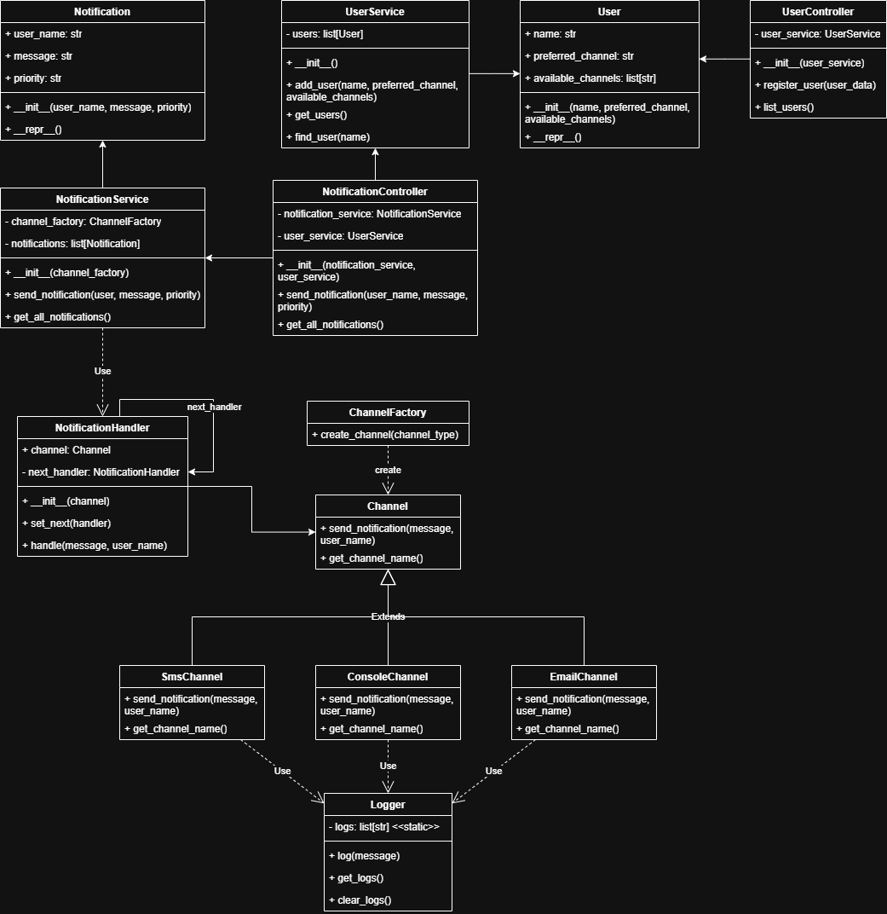

# 🧪 Sistema de Notificaciones Multicanal

## 👤 Autor

**Sergio Nicolás Siabatto Cleves - 1000808481**

---

## 📖 Descripción General

El Sistema de Notificaciones Multicanal es una API REST modular diseñada para gestionar usuarios y enviar notificaciones a través de diversos canales de comunicación como correo electrónico, SMS y consola. El sistema utiliza patrones de diseño avanzados para asegurar un código limpio, mantenible y escalable.

---

## 🎯 Objetivo

El objetivo principal de este proyecto es implementar un sistema de notificaciones que permita a los usuarios registrarse con múltiples canales de comunicación y recibir notificaciones según sus preferencias. El sistema emplea el patrón Chain of Responsibility para manejar los intentos de entrega y el patrón Factory para la creación de instancias de canales.

---

## 🔧 Estructura del Proyecto

El proyecto está organizado en los siguientes directorios y archivos:

- **src/**: Código principal de la aplicación.
  - **app.py**: Punto de entrada, inicializa Flask y define las rutas.
  - **controllers/**: Controladores para manejar solicitudes de usuarios y notificaciones.
    - **user_controller.py**: Maneja solicitudes relacionadas con usuarios.
    - **notification_controller.py**: Maneja solicitudes de notificaciones.
  - **models/**: Modelos de datos.
    - **user.py**: Representa un usuario.
    - **notification.py**: Representa una notificación.
  - **services/**: Lógica de negocio.
    - **user_service.py**: Gestión de usuarios.
    - **notification_service.py**: Gestión de notificaciones.
  - **channels/**: Implementación de canales de comunicación.
    - **channel.py**: Clase base abstracta.
    - **email_channel.py**: Canal de correo electrónico.
    - **sms_channel.py**: Canal de SMS.
    - **console_channel.py**: Canal de consola.
  - **patterns/**: Patrones de diseño.
    - **chain_of_responsibility.py**: Maneja la cadena de entrega.
    - **channel_factory.py**: Crea instancias de canales.
  - **utils/**: Utilidades.
    - **logger.py**: Funcionalidad de logs.
  - **swagger/**: Documentación de la API.
    - **swagger.yaml**: Documentación Swagger.

- **requirements.txt**: Dependencias del proyecto.

- **README.md**: Documentación del proyecto.

---

## ✅ Requisitos

- Uso de Flask para la API REST.
- Implementación de al menos dos patrones de diseño: Chain of Responsibility y Factory.
- Simulación de fallos en canales y reintentos usando canales alternativos.
- Inclusión de logs para los intentos de notificación.
- No se requiere base de datos; se usan estructuras en memoria.
- Código modular, limpio y bien documentado.

---

## 📄 Instrucciones de Instalación

1. Clona el repositorio.
2. Navega al directorio del proyecto.
3. Instala las dependencias:
   ```
   pip install -r requirements.txt
   ```
4. Ejecuta la aplicación:
   ```
   python src/app.py
   ```

---

## 📡 Endpoints de la API

- **POST /users**: Registrar un usuario con nombre, canal preferido y canales disponibles.
- **GET /users**: Listar todos los usuarios registrados.
- **POST /notifications/send**: Enviar una notificación con mensaje y prioridad.
- **GET /notifications**: Listar todas las notificaciones enviadas.
- **GET /logs**: Obtener los logs de intentos de notificación.

---

## 🧪 Ejemplos de Pruebas (curl)

```sh
# 1. Registrar usuario (válido)
curl -X POST http://localhost:5000/users -H "Content-Type: application/json" -d "{\"name\": \"Juan\", \"preferred_channel\": \"email\", \"available_channels\": [\"email\", \"sms\", \"console\"]}"

# 2. Registrar usuario (duplicado, debe retornar 409)
curl -X POST http://localhost:5000/users -H "Content-Type: application/json" -d "{\"name\": \"Juan\", \"preferred_channel\": \"email\", \"available_channels\": [\"email\", \"sms\"]}"

# 3. Registrar usuario (canal inválido, debe retornar 400)
curl -X POST http://localhost:5000/users -H "Content-Type: application/json" -d "{\"name\": \"Maria\", \"preferred_channel\": \"whatsapp\", \"available_channels\": [\"email\", \"sms\"]}"

# 4. Registrar usuario (canal preferido no está en disponibles, debe retornar 400)
curl -X POST http://localhost:5000/users -H "Content-Type: application/json" -d "{\"name\": \"Pedro\", \"preferred_channel\": \"sms\", \"available_channels\": [\"email\"]}"

# 5. Listar usuarios
curl -X GET http://localhost:5000/users

# 6. Enviar notificación (válido)
curl -X POST http://localhost:5000/notifications/send -H "Content-Type: application/json" -d "{\"user_name\": \"Juan\", \"message\": \"Tu cita es mañana.\", \"priority\": \"alta\"}"

# 7. Enviar notificación (usuario no encontrado, debe retornar 404)
curl -X POST http://localhost:5000/notifications/send -H "Content-Type: application/json" -d "{\"user_name\": \"Carlos\", \"message\": \"Mensaje de prueba.\", \"priority\": \"baja\"}"

# 8. Listar notificaciones
curl -X GET http://localhost:5000/notifications

# 9. Obtener logs
curl -X GET http://localhost:5000/logs
```

---

## 🗂️ Diagrama de Clases/Módulos



---

## 🏗️ Justificación de Patrones de Diseño

- **Chain of Responsibility:** Permite gestionar los intentos de entrega de notificaciones a través de múltiples canales de forma flexible y desacoplada. Si un canal falla, el siguiente canal disponible es probado automáticamente.
- **Factory Pattern:** Facilita la creación de instancias de canales según el tipo requerido, promoviendo la reutilización y el desacoplamiento del código.

---

## 📄 Documentación Swagger

La documentación completa de la API, incluyendo ejemplos de uso y descripciones de los endpoints, está disponible en `src/swagger/swagger.yaml`.

---

## 📝 Notas

- El sistema no utiliza base de datos; toda la información se almacena en memoria.
- El código está comentado y estructurado para facilitar su comprensión y mantenimiento.

---