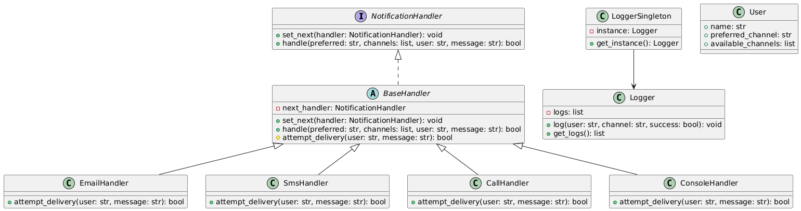

# 🧪 Advanced Individual Lab: Multichannel Notification System (REST API)

**Autor:** Jacel Thomás Enciso Pinzón

---

## 🧠 Descripción del Sistema

Este sistema REST permite registrar usuarios con múltiples canales de comunicación (email, SMS, llamada, consola). Cuando se envía una notificación, se intenta primero con el canal preferido del usuario. Si falla, el sistema recurre a canales alternativos según una **cadena de responsabilidad**. Todos los intentos de envío se registran utilizando un **logger con patrón Singleton**.

---

## 🧩 Patrones de Diseño Usados

### 🔗 Chain of Responsibility

Cada canal de comunicación (Email, SMS, Llamada, Consola) actúa como un handler en una cadena. Si un canal falla (simulado aleatoriamente), el mensaje se pasa al siguiente handler.

### 🧱 Singleton

El `Logger` es una clase Singleton que asegura que todos los intentos de notificación se registren en una única instancia global del sistema.

---

## 📦 Estructura del Proyecto


├── app.py 
├── handlers/
│ ├── base_handler.py 
│ ├── call_handler.py
│ ├── console_handler.py
│ ├── email_handler.py
│ └── sms_handler.py
├── logger/
│ └── logger.py 
├── models/
│ └── user.py 
├── requirements.txt
└── README.md

---

## 🛠️ Instalación y Ejecución

1. Clona el repositorio:

```bash
git clone https://github.com/SwEng2-2025i/MV7h.git
cd Laboratory1
cd 1000809070
```

2. instala las dependencias y ejecuta el servidor:

```bash
pip install -r requirements.txt
python app.py
```

3. Abre tu navegador y ve a: http://127.0.0.1:5000/apidocs para probar con Swagger UI.

---

## 📡 Endpoints de la API

POST /users
Registra un usuario nuevo.

```json
{
  "name": "Thomas",
  "preferred_channel": "email",
  "available_channels": ["email", "sms", "call"]
}
```

Usando Curl:
```bash
curl -X POST http://127.0.0.1:5000/users \
  -H "Content-Type: application/json" \
  -d "{\"name\":\"Thomas\",\"preferred_channel\":\"email\",\"available_channels\":[\"email\",\"sms\",\"call\"]}"
```

GET /users
Lista todos los usuarios registrados.

Usando Curl:
```bash
curl http://127.0.0.1:5000/users
```

POST /notifications/send
Envía una notificación al usuario especificado.

```json
{
  "user_name": "Juan",
  "message": "Tu cita es mañana.",
  "priority": "high"
}
```

Usando Curl:
```bash
curl -X POST http://127.0.0.1:5000/notifications/send \
  -H "Content-Type: application/json" \
  -d "{\"user_name\": \"Juan\", \"message\": \"Tu cita es mañana.\", \"priority\": \"high\"}"
```

---

##  Class/Module Diagram




---

## 🔬 Simulación de Fallos
Cada handler simula un fallo de envío usando random.choice([True, False]). Si un canal falla, el sistema recurre al siguiente canal disponible.

## 📘 Swagger UI
La documentación interactiva se genera automáticamente con Flasgger.

Accede a ella en: http://127.0.0.1:5000/apidocs