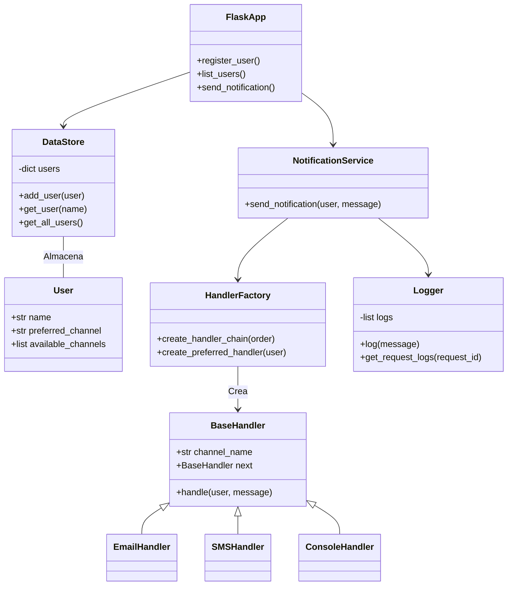

# Sistema de Notificaciones API
### Cristhian Alejandro Alarcón Florido

## Descripción del Sistema
Esta API REST implementa un sistema de notificaciones donde los usuarios pueden registrarse con múltiples canales de comunicación. Al enviar una notificación, el sistema primero intenta entregarla a través del canal preferido del usuario. Si falla (simulado aleatoriamente), recurre a otros canales disponibles usando el patrón Cadena de Responsabilidad.

## Características principales:

- Gestión de usuarios con canales preferidos/disponibles

- Entrega de notificaciones con retroceso automático

- Simulación de fallos en canales

- Registro detallado de actividades

- Arquitectura modular con patrones de diseño

## Documentación de Endpoints
### POST /users
Registra un nuevo usuario

Solicitud:
``` bash
{
  "name": "string",
  "preferred_channel": "string",
  "available_channels": ["string"]
}
```
Respuesta:
``` bash
{
  "message": "Usuario registrado",
  "user": {
    "name": "string",
    "preferred_channel": "string",
    "available_channels": ["string"]
    }
}
```
### GET /users
Lista todos los usuarios registrados

Respuesta:
```bash
[
  {
    "name": "string",
    "preferred_channel": "string",
    "available_channels": ["string"]
  }
]
```
### POST /notifications/send
Envía una notificación

Solicitud:
``` bash
{
  "user_name": "string",
  "message": "string"
}
```
Respuesta:
``` bash
{
  "result": {
    "status": "success/error",
    "channel": "string",
    "message": "string"
  },
  "logs": ["string"],
  "request_id": "string"
}
```
## Diagrama de clases


## Justificación de Patrones de Diseño
### 1. Cadena de Responsabilidad
Implementación: En handlers.py

Propósito: Manejar la entrega de notificaciones a través de múltiples canales

Justificación:

- Desacopla el emisor del receptor

- Permite composición dinámica basada en preferencias del usuario

- Habilita retroceso automático a canales alternativos

- Simplifica la adición de nuevos canales sin modificar lógica principal

### 2. Singleton
Implementación: En data_store.py y logger.py

Propósito: Garantizar única instancia de componentes críticos

Justificación:

- Acceso global a DataStore mantiene estado consistente

- Registro centralizado a través de Logger proporciona vista unificada

- Evita duplicación de recursos para almacenamiento en memoria

### 3. Método Fábrica
Implementación: En handler_factory.py

Propósito: Crear cadenas de manejadores dinámicamente

Justificación:

- Encapsula lógica compleja de creación de cadenas

- Permite ordenar canales según preferencias del usuario

- Proporciona flexibilidad para diferentes configuraciones

- Simplifica la creación de manejadores para clientes

## Instrucciones de Configuración y Pruebas
Requisitos Previos
Python 3.7+

Gestor de paquetes pip

## Instalación
Clonar el repositorio:
``` bash
git clone https://github.com/SwEng2-2025i/MV7h.git
cd Laboratory1
cd 1000835828
```
Instalar dependencias:
``` bash
pip install -r requirements.txt
```
Ejecutar la Aplicación:
``` bash
python app.py
```
