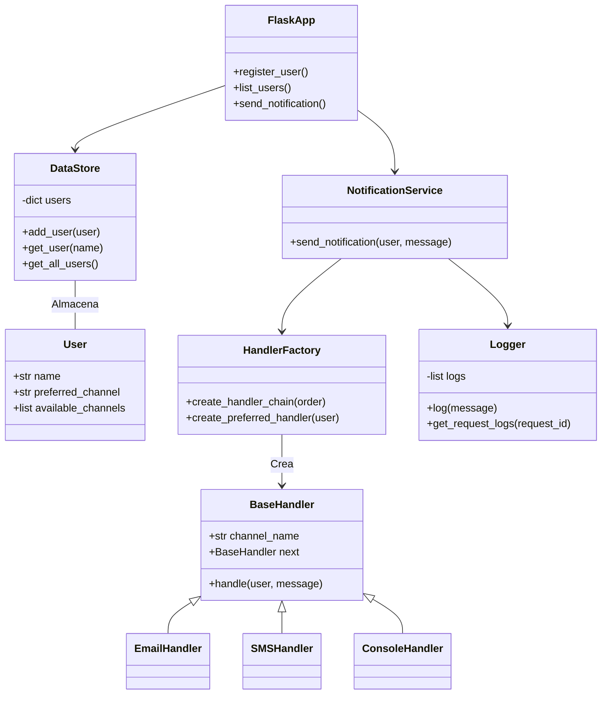

# Sistema de Notificaciones API
### Cristhian Alejandro Alarcón Florido

## Descripción del Sistema
Esta API REST implementa un sistema de notificaciones donde los usuarios pueden registrarse con múltiples canales de comunicación. Al enviar una notificación, el sistema primero intenta entregarla a través del canal preferido del usuario. Si falla (simulado aleatoriamente), recurre a otros canales disponibles usando el patrón Cadena de Responsabilidad.

## Características principales:

- Gestión de usuarios con canales preferidos/disponibles

- Entrega de notificaciones con retroceso automático

- Simulación de fallos en canales

- Registro detallado de actividades

- Arquitectura modular con patrones de diseño

## Documentación de Endpoints
### POST /users
Registra un nuevo usuario

Solicitud:
``` bash
{
  "name": "Juan Pérez",
  "preferred_channel": "email",
  "available_channels": ["email", "sms"]
}
```
Respuestas:
- 201 Created (usuario registrado correctamente)
``` bash
{
  "message": "Usuario registrado",
  "user": {
    "name": "Juan Pérez",
    "preferred_channel": "email",
    "available_channels": ["email", "sms"]
  }
}

```
- 400 Bad Request (datos incompletos o formato inválido)
``` bash
{
  "error": "Datos incompletos"
}

```

### GET /users
Lista todos los usuarios registrados

Respuesta:
```bash
[
  {
    "name": "Juan Pérez",
    "preferred_channel": "email",
    "available_channels": ["email", "sms"]
  },
  {
    "name": "María López",
    "preferred_channel": "sms",
    "available_channels": ["email", "sms", "push"]
  }
]

```
### POST /notifications/send
Envía una notificación

Solicitud:
``` bash
{
  "user_name": "Juan Pérez",
  "message": "Tienes un nuevo mensaje"
}

```
Respuestas:
- 200 OK (notificación enviada con éxito)

``` bash
{
  "result": "Notificación enviada por email",
  "logs": [
    "[INFO] Enviando notificación a Juan Pérez vía email...",
    "[INFO] Notificación enviada con éxito",
    // ... hasta 10 entradas de log
  ]
}
```
- 400 Bad Request (datos incompletos o formato inválido)
``` bash
{
  "error": "Datos incompletos"
}

```

- 404 Not Found (usuario no encontrado)
``` bash
{
  "error": "Usuario no encontrado"
}

```

## Diagrama de clases


## Justificación de Patrones de Diseño
### 1. Cadena de Responsabilidad
Implementación: En handlers.py

Propósito: Manejar la entrega de notificaciones a través de múltiples canales

Justificación:

- Desacopla el emisor del receptor

- Permite composición dinámica basada en preferencias del usuario

- Habilita retroceso automático a canales alternativos

- Simplifica la adición de nuevos canales sin modificar lógica principal

### 2. Singleton
Implementación: En data_store.py y logger.py

Propósito: Garantizar única instancia de componentes críticos

Justificación:

- Acceso global a DataStore mantiene estado consistente

- Registro centralizado a través de Logger proporciona vista unificada

- Evita duplicación de recursos para almacenamiento en memoria

### 3. Método Fábrica
Implementación: En handler_factory.py

Propósito: Crear cadenas de manejadores dinámicamente

Justificación:

- Encapsula lógica compleja de creación de cadenas

- Permite ordenar canales según preferencias del usuario

- Proporciona flexibilidad para diferentes configuraciones

- Simplifica la creación de manejadores para clientes

## Instrucciones de Configuración y Pruebas
Requisitos Previos
Python 3.7+

Gestor de paquetes pip

## Instalación
Clonar el repositorio:
``` bash
git clone https://github.com/SwEng2-2025i/MV7h.git
cd Laboratory1
cd 1000835828
```
Instalar dependencias:
``` bash
pip install -r requirements.txt
```
Ejecutar la Aplicación:
``` bash
python app.py
```
### Documentación Swagger: 
Para acceder a la documentación en Swagger acceder al siguiente link luego de ejecutar la aplicación
``` bash
http://localhost:5000/apidocs
```

### 🧪 Testing con curl o Postman
✅ Registrar usuario
``` bash
curl -X POST http://localhost:5000/users \
-H "Content-Type: application/json" \
-d '{
  "name": "Juan Pérez",
  "preferred_channel": "email",
  "available_channels": ["email", "sms"]
}'
```

📋 Listar usuarios
``` bash
curl http://localhost:5000/users
```
✉️ Enviar notificación
``` bash
curl -X POST http://localhost:5000/notifications/send \
-H "Content-Type: application/json" \
-d '{
  "user_name": "Juan Pérez",
  "message": "Tienes una nueva notificación"
}'

```
🧪 En Postman
1. Abrí Postman y seleccioná POST o GET según el endpoint.
2. Usá http://localhost:5000/users o http://localhost:5000/notifications/send como URL.
3. En la pestaña "Body", seleccioná raw y JSON.
4. Pegá el contenido correspondiente al cuerpo del request.
5. Presioná Send para ejecutar la llamada.


