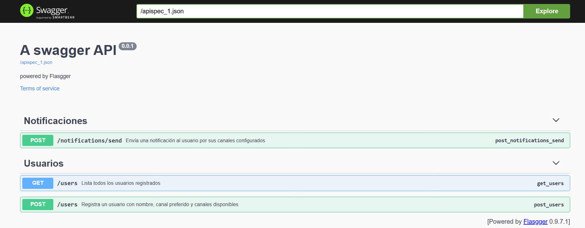
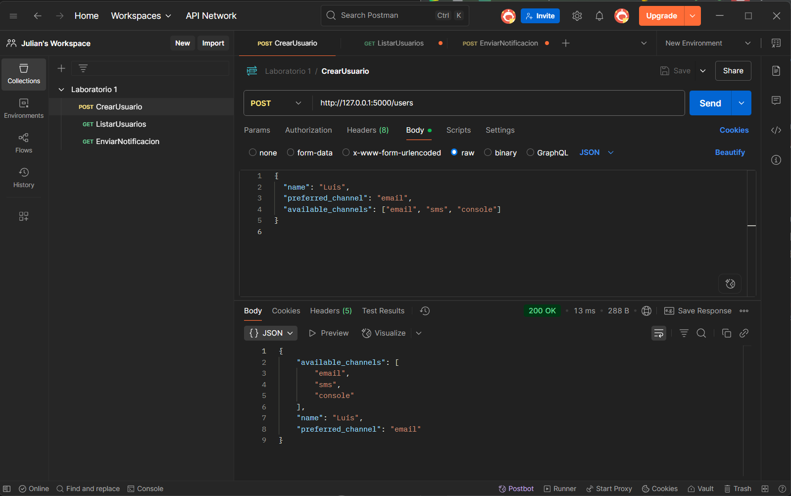
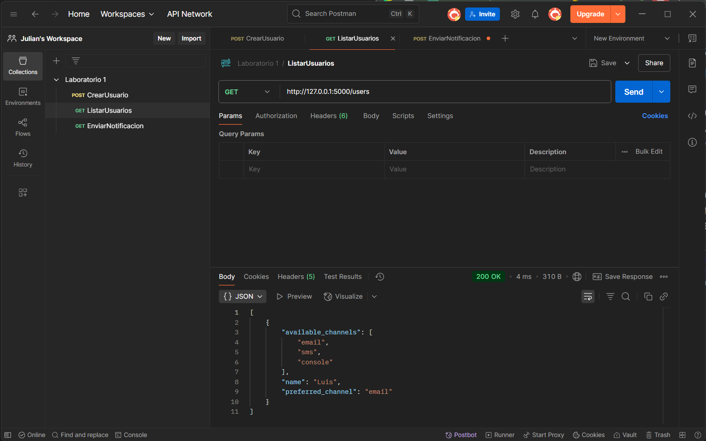
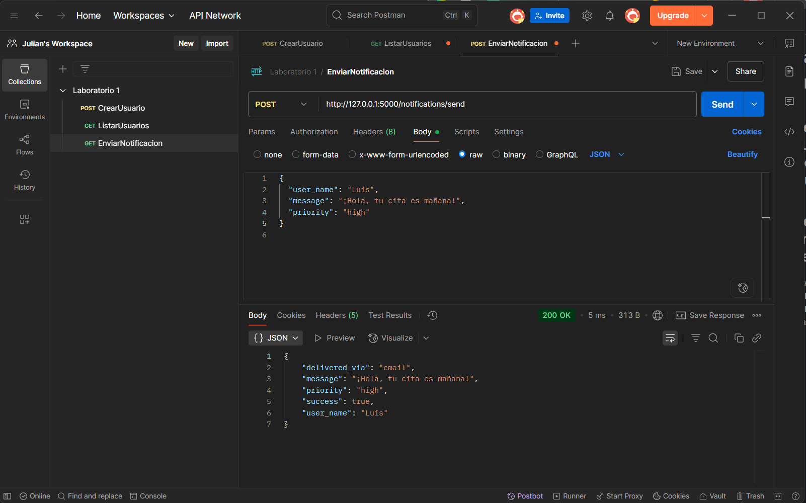
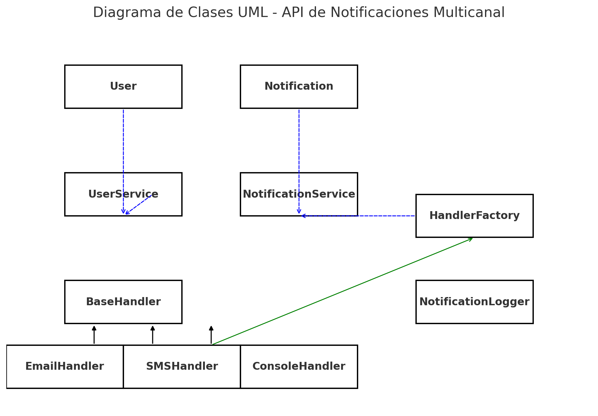

# Laboratorio 1 - Kevin Julian Gonzalez Guerra
## Descripción general
Esta es una **API de Notificaciones Multicanal** que usa:
- **Chain of Responsibility** para intentar enviar la notificación vía Email → SMS → Consola.
- **Factory Pattern** para construir la cadena de handlers según el canal preferido y disponibles.
- **Singleton Pattern** (`NotificationLogger`) para registrar en un único archivo `notifications.log` cada intento de envío.
## Estructura
1001185426/  
│  
├── src/                      ← Código fuente del API  
│   ├── app.py                ← Punto de entrada de Flask  
│   ├── models.py             ← Clases de dominio (User, Notification, etc.)  
│   ├── channels/             ← Implementación de canales y patrones  
│   │   ├── base_handler.py   ← Clase abstracta de Handler (Chain of Responsibility)  
│   │   ├── email_handler.py  ← EmailHandler concreto  
│   │   ├── sms_handler.py    ← SMSHandler concreto  
│   │   ├── console_handler.py← ConsoleHandler concreto  
│   │   ├── factory.py        ← Fábrica para crear instancias de handler  
│   │   └── logger_singleton.py  ← Logger como Singleton  
│   │  
│   ├── services/             ← Lógica de negocio (encolar notificaciones, etc.)  
│   │   ├── user_service.py   ← CRUD de usuarios en memoria  
│   │   ├── notification_service.py ← Lógica para enviar notificaciones  
│   │   └── utils.py          ← Funciones auxiliares (ej.: simulación de fallo)  
│   │  
│   └── swagger.py             ← Configuración de Swagger / OpenAPI  
│
├── README.md                  ← README de entrega
└── requirements.txt           ← Dependencias del proyecto  

## Endpoints

- ### Register a user with name, preferred and available channels

- ### List all users

- ### Send a notification with message and priority

## Diagrama

Relaciones principales de tu API de notificaciones:
* User y Notification: Modelos simples usados por los servicios.

* UserService: Depende de User.

* NotificationService: Depende de UserService, HandlerFactory y Notification.

* BaseHandler: Clase abstracta para el patrón Chain of Responsibility.

* EmailHandler, SMSHandler, ConsoleHandler: Extienden BaseHandler.

* HandlerFactory: Construye instancias de los handlers concretos.

* NotificationLogger: Singleton usado por los handlers para registrar intentos.