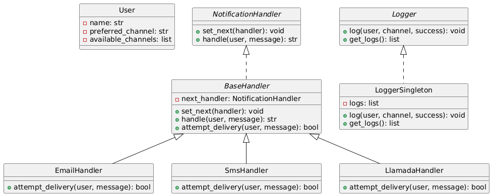

# Sistema de Notificaciones

**Autor:** Juan David Ramirez Lopez

---

## 📘 Descripción

Este proyecto implementa una API REST en Flask para un sistema de notificaciones. Los usuarios pueden registrarse con canales de comunicación disponibles (email, SMS, llamada) y un canal preferido.

Cuando se envía una notificación, el sistema intenta primero enviarla por el canal preferido. Si falla (simulado aleatoriamente), se recurre a los demás canales usando el patrón **Cadena de Responsabilidad**.

El sistema también registra cada intento de envío mediante un logger **Singleton**.

---

## 🎯 Objetivos

- Uso de Flask para construir la API REST.
- Aplicación de **al menos dos patrones de diseño**:
  - Cadena de Responsabilidad
  - Singleton
- Simulación de fallos en canales de notificación.
- Registro de cada intento de entrega.
- Documentación interactiva con Swagger.
- Código limpio, modular y comentado.

---

## 🧱 Estructura del Proyecto

```
Laboratory1/1001185516
├── app.py
├── models/
│ └── user.py
├── handlers/
│ ├── base_handler.py
│ ├── email_handler.py
│ ├── sms_handler.py
│ └── call_handler.py
├── services/
│ └── notification_service.py
| └── user_service.py
├── utils/
│ └── logger.py
└── requirements.txt
```

---

## 🔁 Patrones de diseño utilizados

### 🔗 1. Cadena de Responsabilidad

Se implementa una cadena de handlers (`EmailHandler`, `SMSHandler`, `CallHandler`). Si un canal falla, el siguiente intenta enviar el mensaje.

### 🧩 2. Singleton

El `LoggerSingleton` se asegura de que todos los intentos de envío se registren en una única instancia accesible globalmente.

---

## 🚀 Instalación y ejecución

1. Clona el repositorio:

```bash
git clone https://github.com/SwEng2-2025i/MV7h.git
cd Laboratory1
cd 1001185516
```

2. instalar las dependencias y ejecutar el servidor:

```bash
pip install -r requirements.txt
python app.py o con el compilador que se tenga
```

3. Ejecutar los endpoints:

Primeramente se debe ejecutar postman, abrimos la cuenta y añadimos conexion, en la URL ponemos:

```
http://127.0.0.1:5000/usuarios [POST] --> Ten en cuenta el POST como metodo
```

En el "body" ponemos raw y pegamos el JSON de prueba

```bash
{
  "name": "Juan David Ramirez",
  "preferred_channel": "email",
  "available_channels": ["email", "sms", "call"]
}
```

O tambien podemos ejecutar en otra terminal un CURL

```bash
curl -X POST http://127.0.0.1:5000/usuarios \
  -H "Content-Type: application/json" \
  -d '{
    "name": "Juan David Ramirez",
    "preferred_channel": "email",
    "available_channels": ["email", "sms", "call"]
  }'
```

La salida nos debe arrojar un mensaje de verificación como Usuario registrado con exito

Luego de esto, ejecutamos cambiando la URL, esto para probar el sistema de notificaciones:

```
http://127.0.0.1:5000/notificaciones/enviar [POST] --> Recuerda el metodo POST
```

Igual que con el endpoint anterior, ponemos en postman en "body" raw y copiamos el JSON de prueba

```bash
{
  "user_name": "Juan David Ramirez",
  "message": "Tu cita es mañana a las 9:00 AM."
}
```

Si preferimos hacer un CURL desde otra terminal (usamos data binary debido a las restricciones de nuestro lenguaje como tildes o la letra ñ), ponemos:

```bash
echo '{
  "user_name": "Juan David Ramirez",
  "message": "Tu cita es mañana a las 9:00 AM."
}' | curl -X POST http://127.0.0.1:5000/notificaciones/enviar \
  -H "Content-Type: application/json" \
  --data-binary @-
```

Nos genera un mensaje de entrada y verificamos que no hay error

Por ultimo para pedir las listas de intentos de ingreso, ponemos en la URL lo siguiente:

```
http://127.0.0.1:5000/logs [GET] --> Recuerda el metodo GET (Cambialo)
```

El resultado es un listado JSON con los intentos de notificación, tanto los fallidos como los exitosos

Tambien podemos ejecutar desde curl:

```
curl -X GET http://127.0.0.1:5000/logs
```

Para ver la documentación en swagger, debemos ir a la URL:

```
http://127.0.0.1:5000/apidocs
```

En todos estos procesos procura tener el FLASK del app.py ejecutado

## 📘 Diagrama de clases


