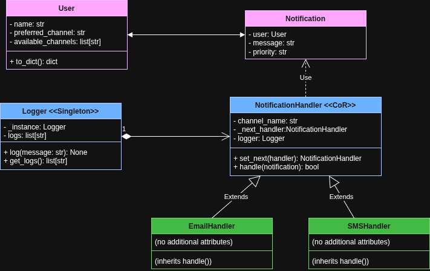

# 📬 Multichannel Notification System API
**Author:** Julian Andres Vargas Gutierrez

---

## 🧠 System Overview

This is a modular REST API developed with Flask that simulates a notification system capable of sending messages to users through multiple communication channels such as email and SMS.

Each user registers a preferred notification channel and a list of available channels. When sending a notification, the system tries the preferred channel first and uses fallbacks if that fails, applying a **Chain of Responsibility**.

---

## 📌 Features

- Register and list users
- Send notifications using preferred or fallback channels
- Log every notification attempt (using Singleton logger)
- Simulated failures with probabilistic success
- In-memory data structures (no database required)
- Swagger documentation (available at `/apidocs`)

---

## 📚 API Endpoints

### ➕ `POST /users`

Register a new user with a preferred channel and available channels.

**Request body:**
```json
{
  "name": "Juan",
  "preferred_channel": "email",
  "available_channels": ["email", "sms"]
}
```

**Response:**
```json
{
  "message": "User created successfully"
}
```
### ➕ `GET /users`

Retrieve all registered users.

**Request body:**
```json
[
  {
    "name": "Juan",
    "preferred_channel": "email",
    "available_channels": ["email", "sms"]
  }
]
```

### ➕ `POST /notifications/send`

Send a notification to a user.

**Request body:**
```json
{
  "user_name": "Juan",
  "message": "Your appointment is tomorrow.",
  "priority": "high"
}
```
**Response:**
```json
{
  "message": "Notification processed",
  "status": "success"
}
```

---

## 🧱 Class & Module Structure

El siguiente diagrama representa las clases principales del sistema, sus atributos, métodos y relaciones:



---

## 🧠 Design Patterns

### 🔗 1. Chain of Responsibility

- **Location**: `services/notification_handler.py`
- Each sending channel (EmailHandler, SMSHandler) acts as a link in a chain.
- If a channel fails (simulated with `random.random()`), the message is transferred to the next available channel.
- The order of the handlers is dynamically defined according to the user's preferred channel.

### 🔁 2. Singleton

- **Location**: `services/logger.py`
- Ensures that a single instance of `Logger` exists throughout the entire execution.
- Centralizes the recording of notification attempts, avoiding duplication or conflict of handlers.

---

## 🚀 Setup & Run Instructions

### 1. Install dependencies

```bash
pip install -r requirements.txt
```

### 2. Run the application

```bash
python main.py
```

### 3. Access Swagger documentation

<http://127.0.0.1:5000/apidocs>

---

## 🧪 Testing with curl

### ➕ Create user

```bash
curl -X POST http://127.0.0.1:5000/users \
  -H "Content-Type: application/json" \
  -d '{
        "name": "Juan",
        "preferred_channel": "email",
        "available_channels": ["email", "sms"]
      }'
```

### ✉️ Send notification

```bash
curl -X POST http://127.0.0.1:5000/notifications/send \
  -H "Content-Type: application/json" \
  -d '{
        "user_name": "Juan",
        "message": "Your appointment is tomorrow.",
        "priority": "high"
      }'
```

### 📋 List users

```bash
curl http://127.0.0.1:5000/users
```

---

## ✅ Notes

- Channel failures are simulated with a 30% probability of failure (70% success).
- All sending attempts are logged to the console using the `Logger` class which implements the Singleton pattern.
- The application uses in-memory data structures: no external database is needed.
- The currently supported channels are `email` and `sms`, and they can be easily extended by adding new handlers.rna.
- Swagger documentation is available at [http://localhost:5000/apidocs](http://localhost:5000/apidocs) and includes interactive examples.

