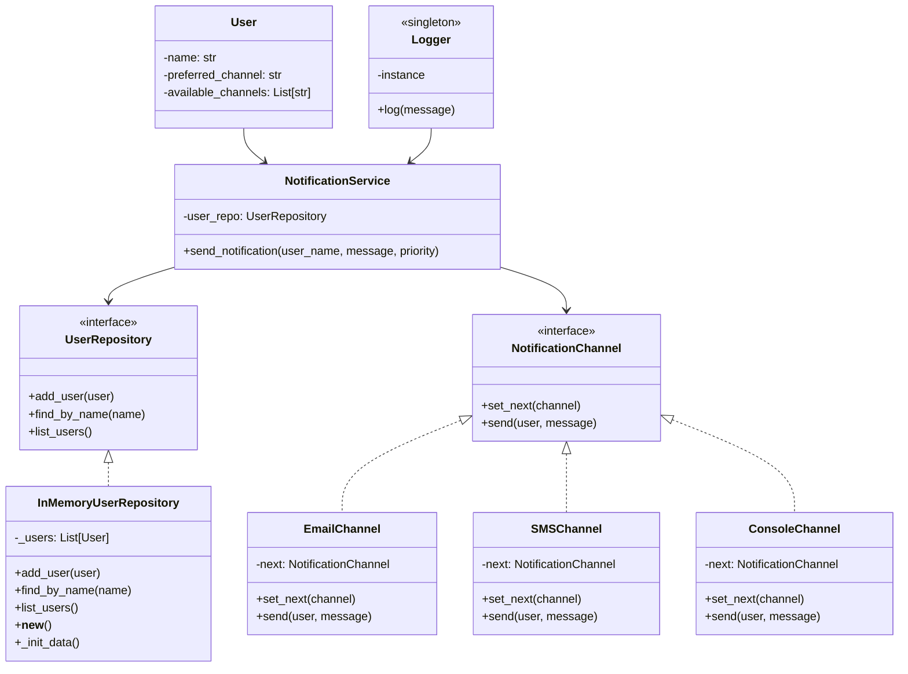

# Notification Service con Flask y Chain of Responsibility

## Autor: Andres Camilo Orduz Lunar

Este proyecto es un sistema de notificaciones basado en Flask que permite registrar usuarios y enviar notificaciones usando distintos canales (email, SMS, consola). El sistema está implementado usando el patrón **Chain of Responsibility** y **Singleton**, junto con **Arquitectura Hexagonal** para intentar enviar la notificación por orden de preferencia y disponibilidad.

## Características principales

- Registro de usuarios con canales disponibles y canal preferido.
- Envío de notificaciones por prioridad (`high`, `medium`, `low`), que determina qué canales están permitidos.
- Implementación del patrón **Chain of Responsibility** para intentar enviar la notificación por el primer canal disponible y permitido.
- Uso del patrón **Singleton** en:
  - El **logger** (para logging centralizado).
  - El **repositorio en memoria (`InMemoryUserRepository`)**, para mantener una sola instancia de almacenamiento de usuarios.
- Uso de **Flasgger** para documentación automática Swagger.
- Repositorio de usuarios en memoria.
- Simulación del éxito o fallo del envío de cada canal (aleatorio).
- Logging centralizado en un archivo (`app.log`).


## 🗂️ Estructura del Proyecto
```bash
├── domain
│ ├── entities # Entidades de dominio (User, NotificationChannel)
│ └── ports # Interfaces de repositorios y canales
├── application # Casos de uso y orquestación
├── infrastructure
│ ├── channels # Implementaciones concretas de canales (email, SMS, consola)
│ ├── logger.py # Logger singleton
│ ├── memory_repo.py # Repositorio en memoria (singleton)
│ └── http_handler.py # Endpoints y rutas HTTP
├── main.py # Punto de entrada de la aplicación
└── app.log # Archivo de logs
```

## 📐 Design Pattern Justifications

Este proyecto utiliza dos patrones de diseño principales: **Chain of Responsibility** y **Singleton**. A continuación se explica la razón detrás de su uso:

### 🔗 Chain of Responsibility

- **Propósito**: Permitir que varios objetos manejen una solicitud sin que el emisor conozca qué objeto la manejará.
- **Aplicación en el proyecto**: El envío de notificaciones se realiza a través de una cadena de canales (`Email`, `SMS`, `Console`). Cada canal verifica si puede manejar la solicitud y, si no puede, pasa al siguiente.
- **Ventaja**: Permite agregar nuevos canales sin modificar la lógica de envío ni romper el principio abierto/cerrado (OCP) de SOLID.

### ♻️ Singleton

- **Logger Singleton**:
  - **Propósito**: Garantizar que haya una única instancia de logger centralizado en toda la aplicación.
  - **Aplicación**: Se usa para registrar los intentos de notificación y sus resultados en `app.log`.
  - **Ventaja**: Evita múltiples instancias y asegura un punto único de escritura de logs.

- **InMemoryUserRepository Singleton**:
  - **Propósito**: Garantizar que haya una sola instancia del repositorio de usuarios.
  - **Aplicación**: El repositorio en memoria se implementa como singleton para mantener una única fuente de verdad en la app Flask.
  - **Ventaja**: Evita inconsistencias y pérdida de datos entre peticiones HTTP.


## 📡 API Endpoints

- **Registrar Usuario**

`POST /users`
Ejemplo:
```bash
curl -X POST http://localhost:5000/users \
     -H "Content-Type: application/json" \
     -d '{"name": "Juan", "preferred_channel": "email", "available_channels": ["email", "sms"]}'
```

- **Listar usuarios** 

`GET /users`
Ejemplo:
```bash
curl http://localhost:5000/users
```
- **Enviar notificación**

`POST /notifications/send`

```bash
curl -X POST http://localhost:5000/notifications/send \
     -H "Content-Type: application/json" \
     -d '{"user_name": "Juan", "message": "Recordatorio: cita mañana", "priority": "high"}'
```

## 🧠 Ejemplo de prioridad
- high: intenta con email, luego sms, luego console.

- medium: intenta con email, luego console.

- low: solo intenta con console.

## ⚙️ Cómo funciona el envío
1. Se toma la prioridad (high, medium, low) y se determinan los canales permitidos.

2. Si el canal preferido del usuario está entre los permitidos y disponibles, se intenta primero.

3. Si falla o no es válido, se intenta con el resto de canales disponibles en orden.

4. Si todos fallan, se responde con delivered: false.

## 🪵 Logs

Todos los intentos de envío se registran en app.log, incluyendo:

- Canal usado

- Usuario destinatario

- Éxito o fallo del envío

## Ejecución

1. Instala dependencias (usa un entorno virtual si deseas):
   ```bash
   pip install Flask flasgger
   ```
2. Ejecuta la aplicación:
   ```bash
   python main.py
   ```
3. La API estará disponible en: http://localhost:5000

## Documentación Swagger

La API está documentada con Swagger UI utilizando Flasgger.

🔍 Acceder a Swagger UI
Una vez que la app esté corriendo, visita:

👉 http://localhost:5000/apidocs

Ahí puedes ver todos los endpoints documentados y probarlos directamente desde el navegador.

## 📐 Diagrama de Clases (Mermaid)


