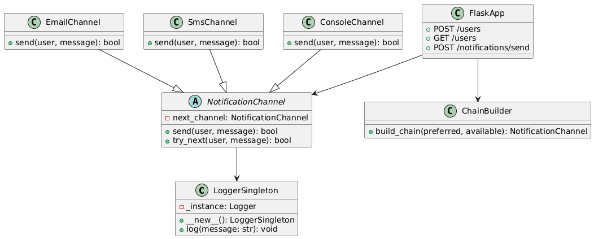


## 📬 Multichannel Notification System API

**Author:** Michael Daniels Oviedo Quiroga
**Framework:** Flask  
**Design Patterns:** Chain of Responsibility, Singleton  

----------

### 🧠 System Overview

This REST API simulates a **multichannel notification system** that sends messages to users through various communication channels like email, SMS, or console. If the preferred channel fails, the system attempts fallbacks using a **Chain of Responsibility** pattern.

----------

### 📐 Class / Module Diagram


----------

### 🎯 Design Pattern Justifications

-   **Chain of Responsibility**:  
    Used to define a fallback mechanism. If the preferred channel fails, the system tries the next available one in order.
    
-   **Singleton (Logger)**:  
    Ensures that all logging is centralized using a single instance. Prevents duplicate logs or fragmented console output.
    

----------

### 📚 API Endpoints

#### ➕ `POST /users`

Registers a user with their preferred and available channels.

**Request:**

```json
`{  "name":  "Juan",  "preferred_channel":  "email",  "available_channels":  ["email",  "sms"]  }` 
```
**Response:**

```json
`{  "message":  "User Juan created successfully"  }` 
```
----------

#### 📋 `GET /users`

Lists all registered users.

**Response:**


```json
`[  {  "name":  "Juan",  "preferred_channel":  "email",  "available_channels":  ["email",  "sms"]  }  ]` 
```
----------

#### ✉️ `POST /notifications/send`

Sends a notification to the specified user using fallback channels.

**Request:**


```json
`{  "user_name":  "Juan",  "message":  "Your appointment is tomorrow.",  "priority":  "high"  }` 
```
**Response:**


```json
`{  "message":  "Notification sent successfully"  }` 
```
Or if all fail:


```json
`{  "message":  "All channels failed"  }` 
```
----------

### 🧪 Setup & Testing Instructions

#### 1️⃣ Install dependencies
```bash
`pip install -r requirements.txt` 
```

#### 2️⃣ Run the app


```bash
`python app.py` 
```

#### 3️⃣ Access Swagger UI

[http://localhost:5000/apidocs](http://localhost:5000/apidocs)

#### 4️⃣ Test using curl

✔ Create user:


```bash
`curl -X POST http://localhost:5000/users \
  -H "Content-Type: application/json" \
  -d '{"name":"Juan","preferred_channel":"email","available_channels":["email","sms"]}'` 
```

✔ Send notification:


```bash
`curl -X POST http://localhost:5000/notifications/send \
  -H "Content-Type: application/json" \
  -d '{"user_name":"Juan","message":"Test message","priority":"low"}'` 
```

✔ List users:


```bash

`curl http://localhost:5000/users` 
```

----------

### ✅ Features Recap

-   Modular and well-documented code
-   No database (uses Python dict for in-memory data)
-   Logger logs all attempts
-   Simulated failures using random probability
-   Swagger UI for full API interaction
-   Easily extendable: add new channels with one class
