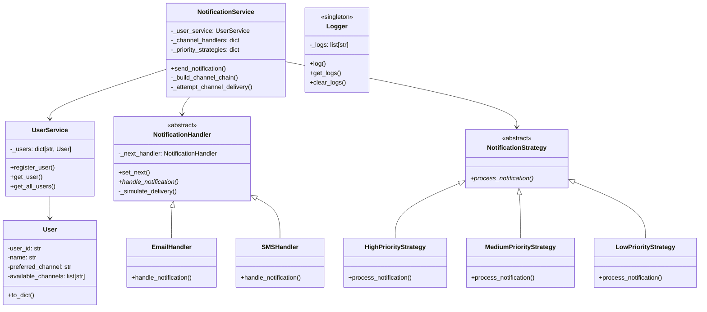

# Multichannel Notification System API

## 📝 System Explanation

This project implements a simple Multichannel Notification System with a REST API using Flask. The system allows users to register with their preferred and available communication channels (e.g., email, SMS). When a notification is sent, the system attempts delivery through the user's preferred channel first. If that fails (simulated randomly), it retries through other available channels in a Chain of Responsibility. The system is designed with modularity and extensibility in mind, leveraging several design patterns.

### Core Features:
* **User Management:** Register and list users with their channel preferences.
* **Notification Sending:** Send notifications to registered users with different priorities.
* **Multichannel Delivery:** Supports email and SMS channels.
* **Simulated Failures:** Randomly simulates success or failure for channel delivery attempts.
* **Logging:** Records all system events and notification attempts.
* **API Documentation:** Integrated Swagger UI for easy API exploration and testing.

## 📐 Design Patterns Used

This system incorporates the following design patterns:

1.  **Chain of Responsibility:**
    * **Justification:** This pattern is used for handling notification delivery across multiple channels. Each `NotificationHandler` (e.g., `EmailHandler`, `SMSHandler`) acts as a link in the chain. When a notification needs to be sent, it's passed to the first handler in the chain (typically the user's preferred channel). If that handler cannot deliver the notification (simulated failure), it passes the request to the next handler in the chain until one succeeds or the chain ends. This decouples the sender of a request from its receivers and allows for dynamic ordering of delivery attempts based on user preferences.
    * **Implementation:** See `handlers.py` for `NotificationHandler` (abstract handler), `EmailHandler`, and `SMSHandler` (concrete handlers). The `NotificationService` (`_build_channel_chain` method) dynamically constructs this chain based on user's preferred and available channels.

2.  **Strategy Pattern:**
    * **Justification:** This pattern is applied to manage different notification priorities (high, medium, low). Instead of having conditional logic within the `NotificationService` to handle different priorities, each priority has its own `NotificationStrategy` (e.g., `HighPriorityStrategy`, `MediumPriorityStrategy`, `LowPriorityStrategy`). This makes it easy to add new priority levels or modify the behavior of existing ones without altering the core `NotificationService` logic. For this lab, the primary difference in strategies is the logging message, but in a real-world scenario, different priorities could dictate different retry mechanisms, logging levels, or even different sets of available channels.
    * **Implementation:** See `strategies.py` for `NotificationStrategy` (abstract strategy) and its concrete implementations. The `NotificationService` uses a dictionary to map priority strings to their respective strategy objects.

3.  **Singleton Pattern (Optional for Logger):**
    * **Justification:** The `Logger` class is implemented as a Singleton. This ensures that there is only one instance of the logger throughout the application, providing a single point of access for all logging operations. This is crucial for collecting all system logs into a centralized, in-memory list, making it easy to retrieve them for debugging or API responses.
    * **Implementation:** The `Logger` class in `logger.py` uses class-level attributes and class methods (`@classmethod`) to maintain a single `_logs` list, effectively behaving as a Singleton.

## 🧱 Estructura del Proyecto

```
Laboratory1/1025060067
├── app.py
├── api/
│ └── api.py
├── handlers/
│ ├── notification_handler.py
│ ├── email_handler.py
│ ├── sms_handler.py
├── models/
│ ├── notification.py
│ └── user.py
├── services/
│ └── notification_service.py
| └── user_service.py
├── strategies/
│ └── notification_strategies.py
├── utils/
│ └── logger.py
└── requirements.txt
```

## 🏗️ Class/Module Diagram


---

## 🔁 Notification Logic

You will simulate delivery attempts via a **Chain of Responsibility**. For example:

1. A user has preferred channel = `email`, available = `[email, sms]`
2. Email channel is attempted (random failure simulated)
3. If it fails, the next channel (sms) is attempted

Use `random.choice([True, False])` to simulate failures.

---

## 🔧 REST API Endpoints

| Method | Endpoint              | Description                                      |
|--------|-----------------------|--------------------------------------------------|
| POST   | `/users`              | Register a user with name, preferred and available channels |
| GET    | `/users`              | List all users                                   |
| POST   | `/notifications/send` | Send a notification with message and priority    |

### Example Payloads

**GET /users** `Lista de usuarios`
```bash
{
  curl -X GET \
  http://localhost:5000/api/users
}
```

**POST /users** `Registrar un usuario nuevo (Juan)`
```bash
curl -X POST \
  http://localhost:5000/api/users \
  -H 'Content-Type: application/json' \
  -d '{
    "name": "Juan",
    "preferred_channel": "email",
    "available_channels": ["email", "sms"]
  }'
```
Respuesta esperada
```bash
{
  "message": "User 'Juan' registered successfully.",
  "status": "success",
  "user": {
    "available_channels": [
      "email",
      "sms"
    ],
    "name": "Juan",
    "preferred_channel": "email",
    "user_id": "cb288e5b-7931-4c6b-b620-e227c487954c"
  }
}
```
**POST /notifications/send** `Enviar una notificación de alta prioridad a Juan (email preferido)`
```bash
curl -X POST \
  http://localhost:5000/api/notifications/send \
  -H 'Content-Type: application/json' \
  -d '{
    "user_name": "Juan",
    "message": "Recordatorio: Su cita es manana a las 10 AM.",
    "priority": "high"
  }'
```
Respuesta esperada
```
{
  "logs": [
    "Initiating notification for 'Juan' with 'high' priority.",
    "Processing HIGH priority notification for Juan.",
    "Starting channel delivery chain for Juan...",
    "Attempting to send notification to Juan via email - SUCCESS",
    "Notification sent successfully to Juan via Email: 'Recordatorio: Su cita es manana a las 10 AM.'",
    "Notification successfully delivered to Juan."
  ],
  "message": "Notification sent successfully.",
  "status": "success"
}
```
**Author:** Daniel Alejandro Ochoa Ruiz

