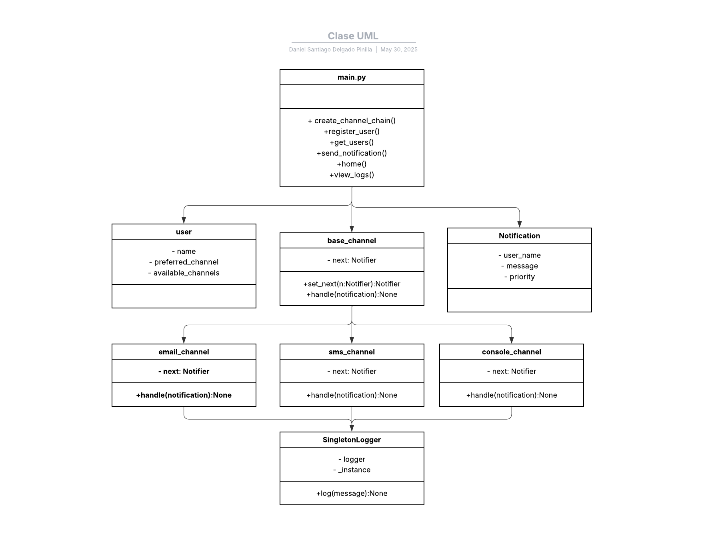
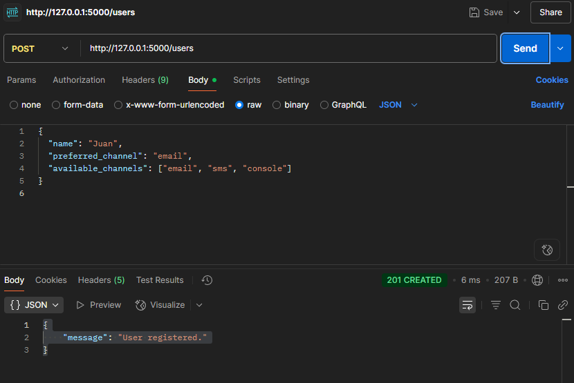
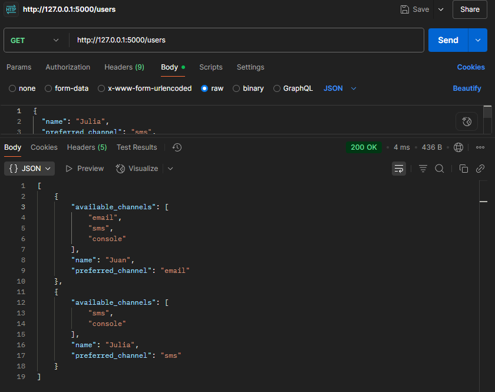
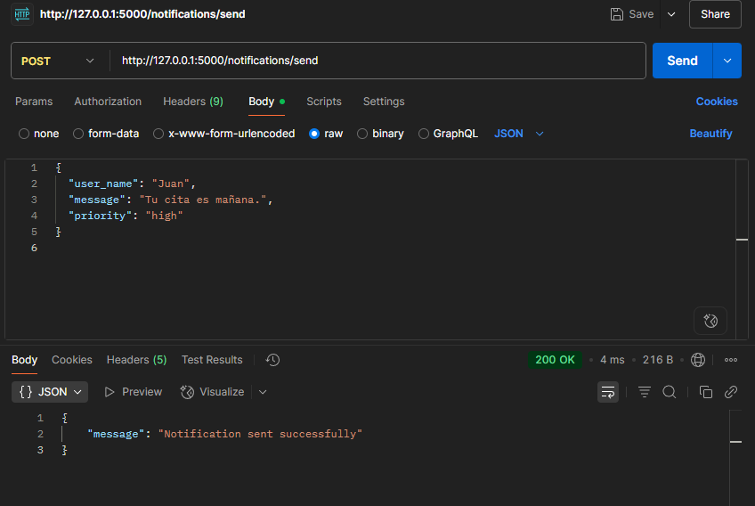
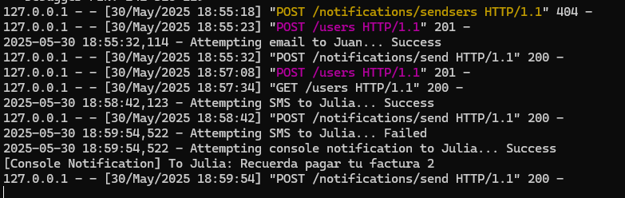
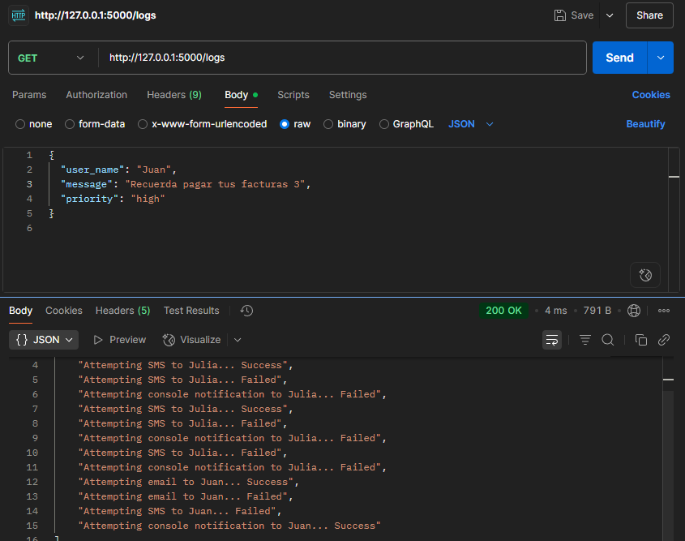
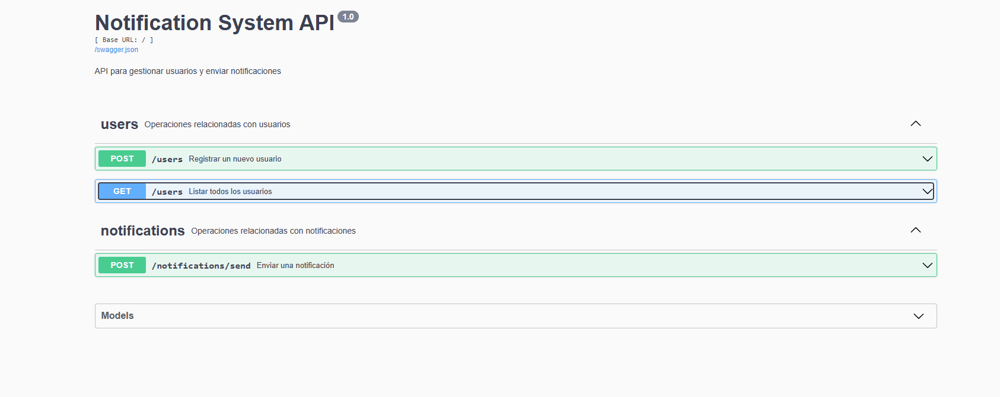

# Notificaciones Multicanal con Flask y Patrón Chain of Responsibility

---

## Autor: Daniel Santiago Delgado Pinilla

---

Este laboratorio es una API REST construida con Flask que implementa un sistema de notificaciones con varios canales usando el patrón de diseño **Chain of Responsibility**, para tener otras opciones de envío de notificaciones en casos de fallo; y el patrón **Singleton**, un objeto que encadena los distintos canales (email, sms, console), en este caso, un logger. Permite registrar usuarios con canales de notificación preferidos y enviar mensajes que serán procesados por la cadena de canales disponibles.

---

## Funcionalidades

- Registro de usuarios con nombre y canales de notificación (Email, SMS, Consola).
- Envío de notificaciones a usuarios mediante su canal preferido.
- Implementación de la cadena de responsabilidad para gestionar múltiples canales de notificación.
- Manejo de errores para usuarios o canales inválidos.
- Manejo de errores de envío de notificaciones a través de Chain of responsability
- Manejo de canales a partir de Singleton
- El logger mantiene el registro de las notificaciones en consola y en endpoint /logs

---

## Endpoints Disponibles

/users

- GET: Devuelve la lista de usuarios completa.
- POST: Registra un usuario nuevo

**uso de POST:**

```JSON
{
  "name": "nombre",
  "preferred_channel": "sms/email/console",
  "available_channels": ["email", "sms", "console"]
}
```

/notifications/send

- POST: Envía una notificación a un usuario al canal de su preferencia, con fallback si falla.

**uso de POST:**

```JSON
{
  "user_name": "nombre",
  "message": "mensaje",
  "priority": "prioridad"
}
```

/logs

- GET: Devuelve una lista con todas las notificaciones enviadas

## Diagrama de clases



---

## Justificación de Patrones de Diseño

### 1. Chain of Responsibility (Cadena de Responsabilidad)

**Justificación:**  
Se utilizó el patrón Chain of Responsibility para permitir que múltiples canales de notificación (como Email, SMS, Console) puedan manejar una solicitud de notificación de forma secuencial y desacoplada. Cada `canal` verifica si puede manejar el tipo de notificación (`Notification.type`) y, si no puede, pasa la solicitud al siguiente en la cadena.

**Beneficios:**
- El emisor puede estar separado de los receptores.
- Permite añadir nuevos canales sin modificar el código existente.
- Facilita la organización modular del sistema de notificaciones.

**Ejemplo:**  
Un usuario tiene como preferencia email como opción de notificación. En el caso de que falle, el sistema pasa a la siguiente opción, por ejemplo, sms. Si falla, sigue hasta lograr enviar la notificación.

---

### 2. Singleton (Opcional)

**Justificación:**  
Se utilizó el patrón Singleton para el `Logger`, con el fin de asegurar que todo el sistema utilice una única instancia de registro de logs. Esto evita conflictos de acceso al logger y asegura una trazabilidad centralizada, utilizando un formato global.

**Beneficios:**
- Garantiza una única instancia compartida del logger.
- Facilita el acceso global al registro desde cualquier parte del sistema.
- Centraliza el formato y la salida de los logs.

**Ejemplo:**  
Todos los objetos `base_channel` (`email_channel`, `sms_channel`, `console_channel`) usan la misma instancia de `SingletonLogger` para registrar cada intento de notificación, asegurando una registro único y centralizado.

---

## Setup y Testing

### Setup

1. Clona el repositorio y entra en la carpeta del proyecto.

2. (Opcional) Crea y activa un entorno virtual.

```bash
python -m venv venv
.\venv\Scripts\Activate
```

3. Instala los requerimientos:

```bash
pip install -r requirements.txt
```

4. Ejecuta main.py

```bash
python app/main.py
```

### Test con postman

Crear usuario en /users

**ejemplo POST:**

```JSON
{
  "name": "Julia",
  "preferred_channel": "sms",
  "available_channels": ["sms", "console"]
}
```
**POST en postman**


**GET en postman:**



Enviar notificación en /notifications/send

```JSON
{
  "user_name": "Juan",
  "message": "Recuerda pagar tus facturas",
  "priority": "high"
}
```



Notificación fallida:



Obtener registro de notificaciones enviadas en /logs

**GET en postman:**



---

## Documentación API con Swagger UI

Esta API incluye documentación interactiva generada automáticamente con Flask-RESTX.

¿Cómo acceder a la documentación?

1. Instala la dependencia necesaria (viene dentro de requirements.txt)
```bash
pip install flask-restx
```

2. Ejecuta la aplicación
```bash
python main.py
```

3. Abre en el navegador la URL [http://127.0.0.1:5000/](http://127.0.0.1:5000/)

- Visualizar todos los endpoints disponibles.
- Consultar detalles de cada ruta, incluyendo modelos de datos esperados.
- Probar la API enviando solicitudes directamente desde el navegador.

**Swagger:**



**Ejemplo POST en Swagger**

