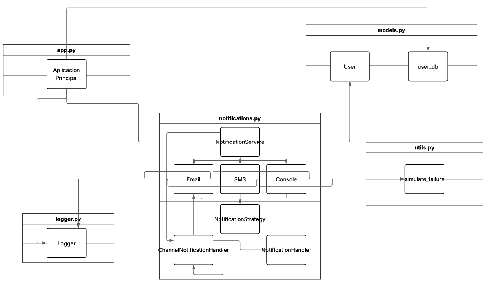

# 🧪 Laboratorio Avanzado Individual: Sistema de Notificación Multicanal (API REST)

**Andres David Caro Mora**

## 📝 Explicación del Sistema

Este proyecto implementa una API REST para un sistema de notificación multicanal. El sistema permite registrar usuarios especificando su nombre, un canal de comunicación preferido (ej: email, SMS) y una lista de canales disponibles para ellos. Cuando se envía una notificación a un usuario, el sistema primero intenta entregarla a través del canal preferido. Si este intento falla (simulado aleatoriamente), el sistema utiliza una cadena de responsabilidad para intentar con los canales de respaldo disponibles para ese usuario.

El sistema utiliza una estructura de datos en memoria para almacenar la información de los usuarios, eliminando la necesidad de una base de datos externa para este laboratorio.

Se utiliza un sistema de logging para registrar todos los intentos de notificación y sus resultados, lo que facilita el seguimiento y la depuración.

La API está documentada utilizando Swagger (Flasgger) para facilitar su exploración y prueba.

## 🔧 Endpoints de la API

La API expone los siguientes endpoints:

### 1. Registrar un Usuario

* **Método:** `POST`
* **Endpoint:** `/users`
* **Descripción:** Registra un nuevo usuario en el sistema.
* **Payload (JSON):**
    ```json
    {
      "name": "Ana",
      "preferred_channel": "sms",
      "available_channels": ["sms", "email", "console"]
    }
    ```
* **Respuesta Exitosa (201):**
    ```json
    {
      "name": "Ana",
      "preferred_channel": "sms",
      "available_channels": ["sms", "email", "console"]
    }
    ```
* **Respuestas de Error:**
    * `400 Bad Request`: Si faltan datos, `available_channels` no es una lista, o `preferred_channel` no está en `available_channels`.
    * `400 Bad Request`: Si el usuario ya existe.


### 2. Listar Todos los Usuarios

* **Método:** `GET`
* **Endpoint:** `/users`
* **Descripción:** Devuelve una lista de todos los usuarios registrados.
* **Respuesta Exitosa (200):**
    ```json
    [
      {
        "name": "Juan",
        "preferred_channel": "email",
        "available_channels": ["email", "sms"]
      },
      {
        "name": "Ana",
        "preferred_channel": "sms",
        "available_channels": ["sms", "email", "console"]
      }
    ]
    ```

### 3. Enviar una Notificación

* **Método:** `POST`
* **Endpoint:** `/notifications/send`
* **Descripción:** Envía una notificación a un usuario específico. El sistema intentará usar el canal preferido y luego los canales de respaldo según la lógica de la cadena de responsabilidad.
* **Payload (JSON):**
    ```json
    {
      "user_name": "Ana",
      "message": "Tu paquete ha sido enviado.",
      "priority": "medium"
    }
    ```
* **Respuesta Exitosa (200):** (Incluso si la notificación falló en todos los canales, la API procesó la solicitud)
    ```json
    {
        "status": "Notification processing completed.",
        "detail": "Notification for Ana sent successfully via sms."
    }
    ```
* **Respuestas de Error:**
    * `400 Bad Request`: Si faltan datos en el payload.
    * `404 Not Found`: Si el `user_name` especificado no existe.

## 📐 Diagrama de Clases/Módulos (Conceptual)



## 🎨 Justificación de Patrones de Diseño

Se han utilizado los siguientes patrones de diseño:

1.  **Cadena de Responsabilidad (Chain of Responsibility):**
    * **Justificación:** Este patrón es ideal para el requisito de intentar enviar una notificación por un canal preferido y, si falla, pasar a canales de respaldo. Cada canal de comunicación (Email, SMS, Consola) se representa como un `Handler` en la cadena. Si un `Handler` no puede procesar la solicitud (es decir, el envío falla o el canal no es aplicable), pasa la solicitud al siguiente `Handler` en la cadena. Esto desacopla al emisor de la solicitud (el servicio de notificación) de los receptores concretos (los manejadores de canal individuales) y permite modificar la cadena o los handlers dinámicamente. En nuestra implementación, la cadena se construye dinámicamente para cada usuario según sus preferencias y canales disponibles.

2.  **Estrategia (Strategy):**
    * **Justificación:** El sistema necesita realizar la acción de "enviar notificación" de diferentes maneras dependiendo del canal (Email, SMS, Consola). El patrón Estrategia permite definir una familia de algoritmos (las diferentes formas de enviar), encapsular cada uno en una clase separada (`EmailStrategy`, `SMSStrategy`, etc.) y hacerlos intercambiables. Cada `ChannelNotificationHandler` en la Cadena de Responsabilidad *utiliza* una `NotificationStrategy` para realizar el envío específico de su canal. Esto promueve el principio de abierto/cerrado, ya que se pueden añadir nuevos canales (estrategias) sin modificar los handlers existentes o el flujo de la cadena.

3.  **Singleton (Opcional, pero implementado para el Logger):**
    * **Justificación:** Se requiere un logger para registrar todos los intentos de notificación. El patrón Singleton asegura que solo exista una instancia del logger en toda la aplicación. Esto es útil para centralizar la configuración del logging (formato, nivel, handlers de salida) y para que todos los componentes del sistema utilicen la misma instancia para registrar mensajes, evitando la duplicación de configuraciones o la dispersión de logs.

## 🚀 Configuración y Pruebas

### Requisitos Previos

* Python 3.7+
* pip (Python package installer)

### Instalación

1.  Clona el repositorio (o crea los archivos como se describe).
2.  Navega al directorio del proyecto (`laboratories/laboratory_1/X/`).
3.  Crea un entorno virtual (recomendado):
    ```bash
    python -m venv venv
    source venv/bin/activate  # En Windows: venv\Scripts\activate
    ```
4.  Instala las dependencias:
    ```bash
    pip install -r requirements.txt
    ```

### Ejecución de la Aplicación

Para iniciar el servidor Flask:
```bash
python app.py