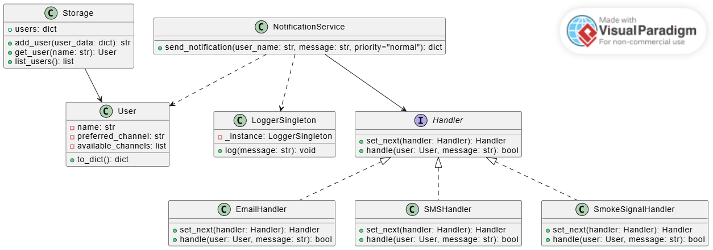

# Laboratorio 1: Sistema de Notificaciones con Flask

**Autor:** Cristian David Machado Guzmán

---

## 📘 Descripción

Este proyecto implementa un sistema de notificaciones como una API RESTful utilizando Flask. Los usuarios pueden registrarse definiendo los canales de comunicación disponibles (correo electrónico, SMS, llamada telefónica) y seleccionar uno como preferido.

Al enviar una notificación, el sistema intenta enviarla primero a través del canal preferido del usuario. Si falla, se recurre a los demás canales en el orden definido mediante el patrón de diseño **Cadena de Responsabilidad**. Cada intento de envío se registra utilizando un logger central implementado como **Singleton**.

---

## Caracteristicas

- Implementa una API REST usando Flask.
- Aplica dos patrones de diseño:
  - **Cadena de Responsabilidad** para manejar los canales de envío.
  - **Singleton** para el sistema de logging.
- Simula fallos aleatorios al intentar notificar.
- Registra cada intento de envío exitoso o fallido.
- Expone la documentación de los endpoints mediante Swagger.
- Mantiene una arquitectura modular, clara y escalable.

---

## 🧱 Estructura del Proyecto

```
LAB1/
├── main.py
├── logger.py
├── storage.py
├── models/
│   └── user.py
├── services/
│   ├── user_service.py
│   ├── notification_service.py
│   └──handlers/
│      ├── base_handler.py
│      ├── email_handler.py
│      ├── sms_handler.py
│      └── smoke_handler.py   

```

---

## 🔁 Patrones de diseño utilizados

### 1. Cadena de Responsabilidad

Los canales de notificación (`EmailHandler`, `SMSHandler`, `SmokeHandler`) se organizan en una cadena. Cada handler intenta enviar el mensaje y, si falla (simulación aleatoria), pasa el control al siguiente.

### 2. Singleton

El `LoggerSingleton` asegura que todas las operaciones de logging compartan la misma instancia, centralizando el registro de los intentos de entrega.

---

## 🚀 Instalación y ejecución

1. Clona el repositorio:

```bash
git clone https://github.com/SwEng2-2025i/MV7h.git
cd Lab1
cd 1107974782
```

2. Instala las dependencias y ejecuta el servidor:

```bash
pip install -r requirements.txt
python main.py
```

---

## 📮 Uso de la API

### Crear un usuario

**Endpoint:**

```
POST /http://127.0.0.1:5000/users
```

**Ejemplo (Postman o CURL):**

```json
{
  "name": "Toro",
  "preferred_channel": "smoke",
  "available_channels": ["smoke", "sms", "email"]
}
```

```bash
curl -X POST http://127.0.0.1:5000/users   -H "Content-Type: application/json"   -d '{
    "name": "Toro",
    "preferred_channel": "smoke",
    "available_channels": ["smoke, "sms", "email"]
  }'
```

---

### Enviar una notificación

**Endpoint:**

```
POST http://127.0.0.1:5000/notifications/send
```

**Cuerpo de la solicitud:**

```json
{
    "user_name": "Toro",
    "message": "Esperar emboscada al amanecer",
    "priority": "high"
}
```

**CURL equivalente:**

```bash
echo '{
  "user_name": "Toro",
  "message": "Esperar emboscada al amanecer"
}' | curl -X POST http://127.0.0.1:5000/notifications/send   -H "Content-Type: application/json"   --data-binary @-
```

---


### Acceder a la documentación interactiva

Visita:

```
http://127.0.0.1:5000/apidocs
```

---

## 📘 Diagrama de clases
v  



---
