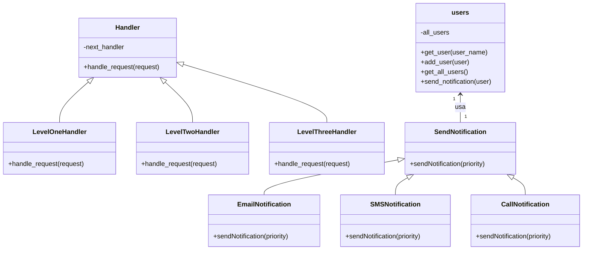

#  LAB: Sistema de notificación multicanal (REST API)

**Autor:** Julian David Rodriguez Fernandez

---

##  Descripción

Este proyecto es una API REST desarrollada con Flask, diseñada para gestionar usuarios en una aplicación. Permite registrar nuevos usuarios, consultar los usuarios existentes y enviar notificaciones personalizadas a cada uno de ellos.

Además de su funcionalidad principal, el proyecto está estructurado siguiendo principios de diseño sólido, e implementa los patrones de diseño Strategy y Cadena de Responsabilidades.

---

##  Estructura del Proyecto

```
1233506795/
├── models/
│   └── notificacion.py
│
├── handler/
│   ├── handler.py
│   ├── main.py
│   └──request.py
│
├── db/
│   ├── db.py
└── app.py      

```

---

## API Endpoints

| Method | Endpoint              | Description                                      |
|--------|-----------------------|--------------------------------------------------|
| POST   | `/users`              | Registra un usuario nuevo                        |
| GET    | `/users`              | Muestra todos los usuarios registrados           |
| POST   | `/notifications/send` | Envia una notificacion                           |


### Example Payloads

#### POST /users

```json
{
  "name": "Juan Perez",
  "preferred_channel": "email",
  "available_channels": ["email", "sms", "call"]
}
```

#### POST /notifications/send

```json
{
  "name": "Juan Perez",
  "message": "Your appointment is tomorrow.",
  "priority": "high"
}
```

---

## Diagrama de clases


---

## Instalación

### 1.Clona el repositoro:

  ```bash
  git clone git@github.com:SwEng2-2025i/MV7h.git
  ```

### 2.Navega al directorio del proyecto:

  ```bash
  cd Laboratory1
  cd 1233506795
  ```

### 3. Instalar dependencias:

```bash
pip install -r requirements.txt
```

### 4. Ejecutar aplicacion: 

```bash
python3 app.py
```

### Documentación Swagger: 

``` bash
http://localhost:5000/apidocs
```

